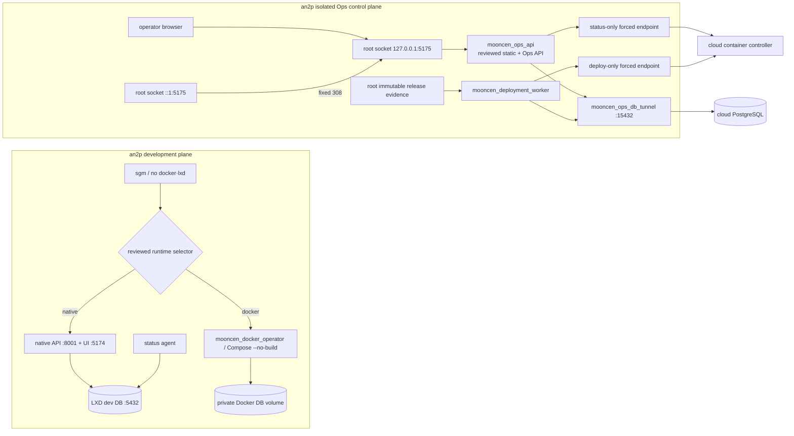

# an2p 개발·운영 제어·Docker 배포 아키텍처

## 결론

an2p는 한 호스트이지만 하나의 권한 영역이 아니다. 개발 runtime, Ops API, 배포 worker,
운영 DB tunnel, Docker daemon 접근을 서로 다른 OS 계정과 credential로 분리한다. 운영자가
보는 Console은 root가 계속 예약하는 `http://127.0.0.1:5175/`에서 reviewed static bundle과
Ops API를 same-origin으로 제공한다. `sgm` 작업공간의 실행 byte나 frontend proxy는 로그인,
CSRF, 승인 요청을 중계하지 않는다.

cloud는 운영 애플리케이션 실행 대상이고, an2p는 clean artifact 생성·검증·승인 queue·고정
배포 protocol만 소유한다. 브라우저는 cloud path, image tag, SSH option 또는 실행 명령을
선택할 수 없다.

> **배포 보류(2026-08-20):** incident-safe bootstrap을 새 snapshot으로 독립 검토하기 전에는
> an2p phase 1과 운영 배포를 진행하지 않는다. 기존
> `refs/mooncen/docker-release-snapshots/223fef9f6786da960faf9951324650ad`는
> 무효이며 어떤 환경에서도 재사용하지 않는다.

## 전체 흐름



## 권한 경계

| 경계 | 실행 계정 | 보유 credential/권한 | 명시적으로 없는 권한 |
| --- | --- | --- | --- |
| 개발 사용자 | `sgm` | native 개발 env, status/docs, fixed selector sudo | docker/lxd group, Ops env/key, release read |
| 개발 Docker | `mooncen_docker_operator` | Docker group, reviewed system unit | Ops DB/key, cloud deploy key |
| Ops API/UI | `mooncen_ops_api` | API DB login, status-only SSH key | deploy key, worker DB login, Docker socket |
| 배포 worker | `mooncen_deployment_worker` | queue DB login, deploy-only SSH key, immutable release read | API auth secret, status key, Docker socket |
| 운영 DB tunnel | `mooncen_ops_db_tunnel` | permitopen-only DB key | remote shell, deploy/status action |

API/worker/tunnel/`sgm`는 `docker`와 `lxd` supplementary group이 없어야 한다. systemd sandbox는
Docker socket과 다른 consumer의 env/key를 `InaccessiblePaths`로 다시 차단한다. credential
file은 root가 소유하고 consumer group만 읽을 수 있으며, deploy/status/DB key digest는 서로
달라야 한다.

cloud SSH도 account와 forced command를 분리한다.

- status endpoint: controller `status`, target identity, presence 같은 read-only protocol
- deploy endpoint: bounded ingress와 stage/load/preflight/promote/rollback protocol
- DB endpoint: `127.0.0.1:5432` local forwarding만 허용

일반 `ubuntu` shell key나 동일 key 재사용은 서비스 경계가 아니다. server-side dispatcher가
exact argv와 stdin schema를 재검증하며 forwarding, PTY, agent/X11, arbitrary shell을 거부한다.

## 5175 신뢰 origin

`mooncen-ops-api.socket`은 boot의 `sockets.target`부터 `127.0.0.1:5175`를 보유한다. Ops API는
Uvicorn `--fd 3`으로 이 socket을 상속한다. API나 runtime pair를 재시작할 때 socket을 멈추지
않으므로 unprivileged process가 그 사이에 가짜 로그인 화면을 bind할 수 없다.

`mooncen-ops-api-ipv6.socket`은 `[::1]:5175`를 별도로 보유한다. 격리 API 계정의 고정 helper는
이 socket이 exact IPv6 loopback listener인지 확인한 뒤 body를 처리하지 않고 다음 응답만
보낸다.

```http
HTTP/1.1 308 Permanent Redirect
Location: http://127.0.0.1:5175/
Cache-Control: no-store
```

따라서 `localhost`가 IPv6를 우선 선택해도 credential을 받는 다른 process가 끼어들 수 없다.
두 socket 모두 non-loopback에 bind하지 않는다. 운영 문서와 root-only credential receipt는
항상 canonical IPv4 URL을 표시한다.

static UI는 reviewed source에서 pinned Node container와 lockfile로 build한다. root installer가
pair의 `control/ops-console-dist`에 설치하고 canonical manifest가 exact file set, size,
SHA-256, same-origin API base와 CSRF cookie 이름을 결박한다. API startup과 각 file read가
owner/mode/no-symlink/inode/digest를 재검증한다. `/api` router가 SPA fallback보다 먼저이고,
unknown API는 HTML이 아니라 JSON 404다. index/auth는 `no-store`, hashed asset만 immutable
cache하며 CSP와 frame denial을 적용한다.

## atomic control/Docker runtime pair

control code와 개발 Docker runtime policy/environment는 별도 current pointer로 움직이지 않는다.
immutable release evidence는 pair 안의 mutable alias가 아니라 source tree로 고정된 sibling root에
new-only로 보관한다.

```text
/opt/mooncen-an2p-runtime/current
  -> releases/runtime-pair.<commit40>.<source-tree40>.<policy64>
       ├─ .pair-receipt.json
       ├─ control/
       │    └─ ops-console-dist/.mooncen-ops-static.json
       └─ docker/
            ├─ development.env
            ├─ activation.json
            └─ reviewed runtime policy + Compose bytes

/opt/mooncen-an2p-control/current -> ../mooncen-an2p-runtime/current/control
/opt/mooncen-an2p-docker/current  -> ../mooncen-an2p-runtime/current/docker
/opt/mooncen-an2p-docker/evidence/<source-tree>/
  ├─ compose.production.yaml
  ├─ images.tar
  ├─ release.json
  └─ validation.json
```

pair receipt는 commit/tree/build policy, control inventory, Docker runtime inventory와 environment
digest를 결박한다. sibling evidence는 phase 1에서 root가 worker-readable mode로 new-only publish할
뿐 worker release root나 production DB로 보내지 않는다. root runtime manager의
`activate-development`가 operation lock 아래 다음 순서로 전환한다.

1. target pair 구조·receipt·두 inventory와 현재 native/Docker/finalized-control prestate 검증
2. transaction journal durable publish
3. old control consumers와 선택된 development runtime을 중지하고 단일 `current` pointer 원자 교체
4. control API/worker/tunnel/status는 disabled로 유지한 채 Docker만 enable/start
5. Docker `8001`/`5174` health 뒤 exact pair/tree/receipt/target/environment pending-finalization fsync
6. journal 제거

중간 실패는 previous pair의 exact native/Docker와 finalized control prestate로 되돌린다. previous가
없는 first install도 reviewed native API/frontend와 health로 복구한다. boot recovery unit이 모든
runtime unit보다 먼저 journal을 수렴시킨다. socket activation이 전환 중 old API를 시작하지 못하도록
각 service start gate가 operation lock, journal과 pair-bound development/finalized phase를 확인한다.
manager child selector는 held operation-lock descriptor를 inode/mode/owner까지 검증해 상속받는다.
human `native-select`/`docker-select`는 같은 lock을 먼저 획득하므로 pending/journal commit 중 끼어들 수
없고, crash journal이 남으면 fail-close한다. isolated phase-2 convergence와 finalize/rotation의 최종
Docker status·8001/5174 proof 및 성공 JSON도 같은 fence 안에 있다.

root-of-trust bootstrap은 recovery unit을 arm하기 전 independently authorized exact installer
SHA-256을 확인하고 검증한 byte를
`/var/lib/mooncen-an2p-runtime/reviewed-install-runtime-snapshot.sh`에 `root:root 0700`으로
fsync·atomic publish한다. parent directory도 fsync한다. recovery와 final trust commit은 mutable
`sgm` worktree를 보지 않고 이 불변 root stage만 실행한다. stage가 durable하지 않으면 recovery를
arm하거나 host-security mutation을 시작하지 않는다.

stage가 durable해진 뒤 bootstrap은 pre-trust host-security mutation 전에 enabled
`mooncen-an2p-bootstrap-recovery.service`를 durable publish한다. 이어 `sgm`의
docker/lxd membership을 제거한 뒤 옛 GID를 여전히 보유한 exact `sgm` process만 재검증해
pidfd로 고정한다. catch·block·ignore할 수 없는 `SIGSTOP`으로 먼저 동결하므로 stale
host-root-capable process에 signal handler 실행 기회를 주지 않는다. 같은 pidfd로 `SIGKILL`한 뒤
bounded exit 대기와 old-GID rescan을 수행하고 group membership 부재도 다시 검증한다.
`loginctl terminate-user`는 호출하지 않으므로 이후 연결된 clean SSH session은 제거 대상이 아니다.
reviewed installer stage는 `trust_committed` 성공 뒤에만 제거한다.

`bootstrap-development.json`은 `prepared` → `membership_revoked` →
`privileged_processes_drained` → `native_restored` → `trust_committed`의 단조 상태만 기록한다.
기존 native 선택은 target 존재와 무관하게 기존 API/frontend user service를 직접 복원하고,
reviewed `mooncen-development-runtime.target`은 phase 1이 나중에 설치한다. recovery unit은
`Restart=on-abnormal`, 30초 간격, 최대 한 번 자동 재시작, 15분 start timeout으로 signal/reboot만
제한적으로 재개한다. 명시적 invariant·health·설치 실패는 fail-stop이며 진단 뒤 수동으로만
재시도한다. public runtime health와 trust byte fsync까지 끝난 `trust_committed`에서만 unit을
disable한다. recovery sandbox는 selector의 IPv4 health probe에 필요한 `AF_INET`과 systemd
control의 `AF_UNIX`만 허용한다.

phase 2의 trusted `finalize-control`만 exact transport를 stage하고 registration 전용 DB tunnel을
시작한다. status/deploy/DB transport probe와 evidence handoff가 성공하면 dedicated DB role로
release/PASS receipt를 idempotently 등록하고 root-only finalization receipt를 publish한다. 그 뒤에만
Ops API, worker, system status agent를 enable/start하고 full readiness를 증명한다. phase-2 실패나
SIGKILL/reboot 재시도는 pending exact transaction에서 이어가며 phase-1 Docker를 내리거나 pair를
rollback하지 않는다.

최초 설치의 단일 canonical order는 **phase-1 Docker PASS → an2p `/run` one-use key generation과
private-key strict receive → fresh backup/guarded cloud native setup → public-key dedicated endpoint
provision → pending receipt target-identity bootstrap → strict 8-field exporter/receiver와 reviewed
config/known-host receive → immutable prepare → trusted finalize**다. key receive까지는 an2p local
state만 바뀌며 phase 1 전에는 어떤 production mutation도 없다.

## 개발 runtime 상호 배제

개발 runtime은 다음 둘 중 하나다.

- native: `sgm` user `mooncen-api` + `mooncen-frontend`, LXD dev DB
- Docker: system `mooncen-docker-dev`, private named DB volume

고정 selector가 root marker, native user unit과 Docker system unit의 stop/disable/start를 한
경계에서 처리한다. native unit의 ExecCondition도 authoritative root selection을 확인한다.
Docker start는 native unit이 inactive인지, native start는 Docker unit이 inactive인지 확인한
뒤에만 성공한다. runtime 전환은 DB volume이나 LXD instance를 삭제하지 않는다.

개발 사용자의 direct Docker/LXD host-root membership은 금지한다. Docker lifecycle은
`mooncen_docker_operator` system unit, LXD 일상 lifecycle은 root fixed helper만 사용한다.
reviewed release가 아닌 현재 worktree build는 실험에는 쓸 수 있어도 persistent Docker runtime과
운영 Promote의 evidence가 될 수 없다.

## container 배포 증적과 실행

```mermaid
sequenceDiagram
  participant Build as clean build/smoke
  participant Root as an2p root installer
  participant Dev as persistent Docker dev
  participant DB as append-only Ops DB
  participant UI as Ops admin
  participant Worker as deployment worker
  participant Cloud as forced endpoint/controller

  Build->>Root: release.json + validation.json + compose + images.tar
  Root->>Root: seal pair + sibling evidence (no prod network/DB)
  Root->>Dev: journaled pair select; Docker start
  Dev-->>Root: 8001/5174 health; durable pending receipt
  Root->>Root: strict secret/3 transport receive + prepare
  Root->>Root: stage DB tunnel; probe status/deploy/DB
  Root->>Root: exact evidence handoff to worker release root
  Root->>DB: dedicated role registers release + fresh PASS receipt
  Root->>Root: publish finalization; start API/worker/status
  UI->>DB: typed approval + job + deployment (one transaction)
  Worker->>DB: claim job/deployment CAS; re-read evidence/approval
  Worker->>Cloud: status precondition + fixed ingress/controller argv
  Cloud->>Cloud: operation-lock CAS + durable transaction
  Worker->>Cloud: status reconciliation
  Worker->>DB: terminal runtime current/previous/native evidence
```

release/receipt/approval은 append-only다. DB trigger는 JSON exact key set, scalar column binding,
PASS check, target/environment/identity, expiry와 one-time approval consumption을 검증한다. API는
live status의 generation, active/previous digest와 full canonical state hash를 typed confirmation,
approval, queue parameter에 동일하게 저장한다. worker는 lease 후 다시 읽고 controller도 lock
안에서 같은 CAS를 확인한다.

Promote는 fixed ingress `prepare/upload` 이후 `stage → load-images → preflight → promote`,
container rollback은 CAS-bound `rollback`, Docker→native maintenance는 pinned baseline을 포함한
CAS-bound `rollback-native`만 실행한다. local SSH timeout이나 worker crash를 곧바로 실패로
확정하지 않고 remote transaction이 사라질 때까지 status를 재조정한다.

기존 native code 배포는 service worker가 claim하지 않는다. 최초 bootstrap과 향후 native
maintenance는 an2p 신뢰 운영자의 대화형 Tailscale 경로만 사용한다. container state,
transaction 또는 native intent가 있으면 native mutation은 중단한다.

## 서비스 시작 관계

```text
sockets.target
  ├─ mooncen-ops-api.socket (127.0.0.1:5175, persistent)
  └─ mooncen-ops-api-ipv6.socket ([::1]:5175, persistent redirect)

mooncen-an2p-bootstrap-recovery (root trust 설치 중에만 enabled)
  ├─ exact installer SHA 검증 → root:root 0700 immutable stage atomic publish
  ├─ old-GID process만 pidfd SIGSTOP/SIGKILL, rescan; clean SSH 유지
  ├─ 기존 API/frontend 직접 복원; development target 불필요
  └─ trust_committed 뒤 disable 및 reviewed installer stage 제거

mooncen-an2p-runtime-recovery
  ├─ phase 1: selected mooncen-docker-dev only
  └─ finalized: mooncen-ops-db-tunnel
       ├─ mooncen-ops-api
       ├─ mooncen-deployment-worker
       └─ mooncen-ops-status-agent

mooncen-development-runtime.target
  ├─ native selection: mooncen-api + mooncen-frontend
  └─ Docker selection: native units disabled; system Docker unit active

legacy user mooncen-status-agent ──> globally/local masked
mooncen-docs ──────────> generated-document root only
```

Ops API와 worker는 system account이고 `sgm` user manager의 생명주기와 무관하다. 과거 user
control-plane unit은 전역 mask한다. status agent는 retired frontend service가 아니라 개발
runtime target에만 의존한다.

## 실패 시 동작

| 실패 | 안전 동작 |
| --- | --- |
| reviewed static receipt/byte 불일치 | Ops API startup/asset read 503, mutation UI 미제공 |
| IPv4 API restart | root socket이 계속 port 보유; start gate 통과 후 새 API만 기동 |
| IPv6 redirect restart | root IPv6 socket이 계속 port 보유; credential 수집 process bind 불가 |
| pair switch 중 crash | journal을 boot recovery가 previous/target 한 쪽으로 수렴 |
| reviewed installer stage 검증·게시 실패 | recovery arm과 host-security mutation 전 fail-stop |
| bootstrap explicit failure | 자동 재시작 없이 fail-stop; journal/stage 보존 후 운영자 수동 재시도 |
| bootstrap signal/reboot | 30초 뒤 최대 한 번, 완료 phase를 반복하지 않고 journal에서 재개 |
| 옛 docker/lxd GID process | pidfd `SIGSTOP`으로 uncatchable freeze 후 `SIGKILL`, bounded wait/rescan; clean SSH 유지 |
| development target 미설치 | 기존 API/frontend를 직접 복원; phase 1이 reviewed target 설치 |
| status-only transport 실패 | readiness false, Promote/rollback 비활성 |
| worker/deploy transport 실패 | job을 즉시 성공/실패로 단정하지 않고 remote status 재조정 |
| PASS receipt/approval 만료 | API와 DB가 queue INSERT 거부 |
| native/container runtime overlap | selector와 unit condition이 fail-closed |
| controller state와 DB timeline drift | 새 승인/배포 차단, 운영자 reconciliation 필요 |

## 운영 확인

```bash
curl --noproxy '*' -fsS http://127.0.0.1:5175/health
curl --noproxy '*' -fsSI http://127.0.0.1:5175/
curl -g -fsSI 'http://[::1]:5175/'

systemctl --no-pager --full status \
  mooncen-an2p-runtime-recovery.service \
  mooncen-ops-db-tunnel.service \
  mooncen-ops-api.socket mooncen-ops-api.service \
  mooncen-ops-api-ipv6.socket mooncen-ops-api-ipv6.service \
  mooncen-deployment-worker.service

systemctl --user --no-pager --full status \
  mooncen-development-runtime.target \
  mooncen-status-agent.service mooncen-docs.service

sudo /usr/local/libexec/mooncen-an2p-service-control runtime-status
sudo /usr/local/libexec/mooncen-an2p-service-control lxd-db-status
```

GO 전에는 다음을 함께 확인한다.

- canonical IPv4 health와 IPv6 fixed redirect가 정확함
- 5175 두 listener가 root systemd socket 소유이며 non-loopback listener가 없음
- retired user control-plane unit이 disabled·globally masked이고 별도 proxy listener가 없음
- API/worker/tunnel/`sgm`이 docker/lxd group과 다른 consumer credential에 접근할 수 없음
- worker heartbeat, PASS receipt, controller status와 DB timeline이 exact 일치
- system/user failed unit이 없음

## 개발 DB 데이터 정책

빈 개발 DB는 운영 credential fallback보다 안전한 기본 상태다. 기능 검증 데이터가 필요하면
`tools/sync_production_to_development.py`의 공개 catalog-only 절차를 사용한다. 사용자, OAuth,
Ops session/audit, 비밀과 원본 운영 식별자는 복제하지 않는다. 자세한 계약은
[`production-to-development-sync.md`](production-to-development-sync.md)를 따른다.
