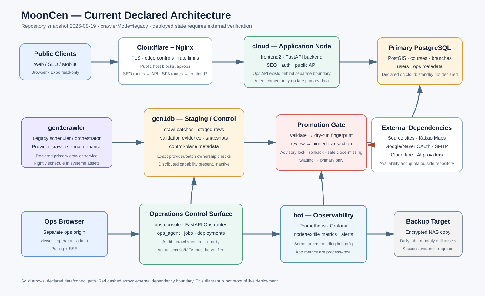
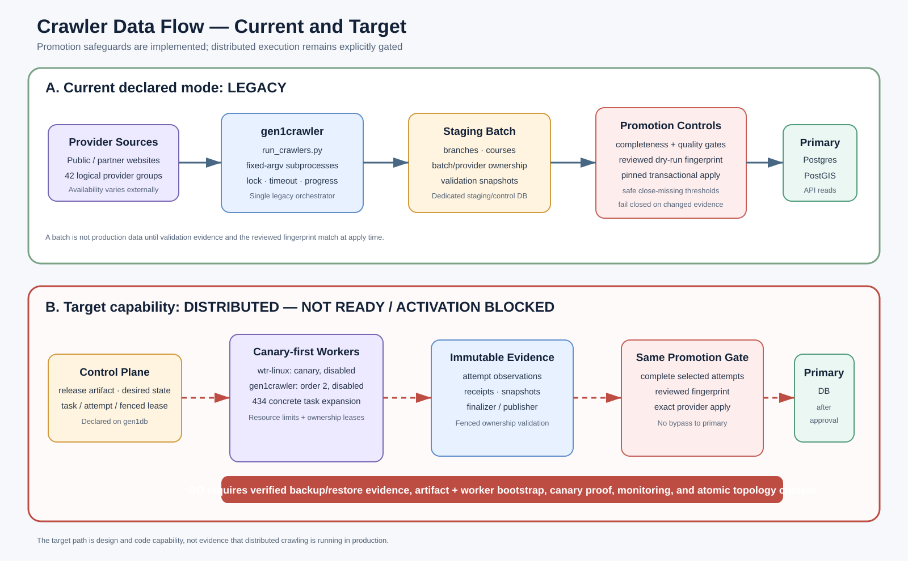

# MoonCen 전체 아키텍처 — 간략본

## 1. 한눈에 보는 결론

MoonCen은 전국 문화센터·공공 강좌 정보를 수집하고 정규화하여 검색·지도·개인화 기능으로 제공하는 시스템입니다. 구조의 중심은 다음 네 단계입니다.

1. 제공기관 사이트에서 강좌와 지점 정보를 수집합니다.
2. 스테이징 DB에서 배치·소유권·완전성·품질을 검증합니다.
3. 검토된 fingerprint와 동일한 배치만 운영 PostgreSQL/PostGIS에 반영합니다.
4. FastAPI가 사용자 웹, SEO 페이지, 모바일, 별도 운영 콘솔에 데이터를 제공합니다.

저장소의 안전장치는 전반적으로 강합니다. DB 계정 분리, fail-closed 설정, checksum 기반 마이그레이션, 크롤러 fencing, 스테이징 반영 fingerprint, 불변 릴리스·백업 설계가 확인됩니다. 반면 실제 배포 상태와 저장소 선언의 일치 여부, 대량 dirty worktree, 최신 토폴로지와 과거 HA 문서의 충돌, 운영 DB 단일 장애 지점은 우선 확인해야 합니다.

## 2. 현재 선언된 구성

| 영역 | 현재 선언 | 핵심 역할 |
|---|---|---|
| `cloud` | frontend2, FastAPI, 운영 PostgreSQL/PostGIS, AI | 사용자 트래픽과 운영 데이터의 중심 |
| `gen1crawler` | legacy crawler owner | provider crawler 실행과 수집 orchestration |
| `gen1db` | staging DB, crawler control의 desired 위치 | 수집 배치·검증·제어 메타데이터 |
| `bot` | Prometheus, Grafana, 선택적 Uptime Kuma | 인프라·서비스·크롤러 상태 수집과 알림 |
| `wtr-linux` | 분산 canary worker 후보, 현재 비활성 | 향후 분산 수집과 Ollama 후보 |
| NAS | 암호화·서명된 일일 백업 대상 | DB 및 참조 산출물 보관 |

> 이 표는 저장소가 선언하는 상태입니다. 실제 배치, 활성 unit, 배포 commit과 접근 제어는 서버에서 검증해야 합니다.

## 3. 주요 애플리케이션

| 구성 요소 | 기술 | 설명 |
|---|---|---|
| 사용자 웹 `frontend2` | React 18, TypeScript, Vite | 검색, 필터, 지도, OAuth, 찜·내강좌, SEO 연동 |
| API `backend` | FastAPI, SQLAlchemy | 공개 API, 인증, 사용자 기능, SEO, Ops API |
| 운영 DB | PostgreSQL + PostGIS | 강좌·지점·사용자·운영 데이터, 공간·전문 검색 |
| 크롤러 | Python, requests/Selenium, YAML target | 제공기관별 수집, 정규화, 배치 생성 |
| 운영 콘솔 `ops-console` | React 19, TanStack Query, SSE | 서비스·크롤러·품질·잡·배포·감사 관리 |
| 운영 에이전트 `ops_agent` | Python worker/service | 상태 수집, 작업 실행, 분산 제어, 배포 보조 |
| 모바일 `mooncen-app` | Expo 57, React Native | 공개 조회 API 기반 검색·지도·기기 로컬 찜; 출시 전 단계 |
| AI 파이프라인 | Python, Ollama/Gemini | 규칙 기반 제목·분류 보완과 LLM 태그 보강 |

구형 `frontend/`는 의도적으로 build가 실패하는 퇴역 Google Maps 클라이언트이며 운영 대상이 아닙니다.

## 4. 핵심 데이터 흐름

### 사용자 조회

`사용자 → Cloudflare/Nginx → frontend2 또는 FastAPI → PostgreSQL/PostGIS`

- 강좌 검색은 키워드, 분류, 제공자, 비용, 연령, 일정, 접수 상태, PostGIS 반경을 결합합니다.
- 인증은 HttpOnly JWT cookie와 CSRF token을 사용합니다.
- 공개 호스트는 `/api/ops`와 운영자 로그인 경로를 차단합니다.

### 강좌 수집·반영

`외부 제공기관 → gen1crawler → staging/control DB → 검증·dry-run → 승인된 transaction → 운영 DB`

- 배치 ID, provider 소유권, 수집 완전성, 급격한 데이터 감소를 검증합니다.
- dry-run fingerprint가 검토 시점과 달라지면 운영 반영을 중단합니다.
- 운영 반영은 advisory lock과 단일 transaction을 사용합니다.
- 단, 실제 legacy 실행에서 `CRAWL_WRITE_MODE`가 무엇인지는 환경 확인이 필요합니다. 코드는 direct-primary와 staging 경로를 모두 보유합니다.

## 5. 현재 구조와 목표 구조를 구분해야 하는 이유

| 구분 | 현재 선언 | 목표 기능 |
|---|---|---|
| 실행 방식 | `crawlerMode: legacy` | control plane 기반 분산 실행 |
| worker | 모두 `enabled: false` | `wtr-linux` canary 후 `gen1crawler` 확장 |
| task 규모 | 42개 논리 provider 그룹 | 약 434개 concrete task로 확장 |
| 상태 | legacy owner가 실행 | release artifact, lease, attempt, immutable evidence 활용 |
| 판정 | 현재 운영 모델 | 코드·설계는 있으나 활성화 조건 미충족 |

분산 전환은 기능을 켜는 수준이 아닙니다. 백업·복구 증거, 서명 artifact와 worker bootstrap, canary, 모니터링, legacy scheduler 정지, 토폴로지 변경을 하나의 승인된 전환으로 처리해야 합니다.

## 6. 확인된 강점

- 운영 API가 DB owner 계정 사용을 거부하고 기능별 DB role을 분리합니다.
- 운영에서 CORS·Trusted Host·OAuth·DB TLS가 fail-closed 되도록 설계돼 있습니다.
- 크롤러 외부 HTTP와 Selenium 실행에 SSRF·redirect·DNS rebinding·sandbox 검증이 있습니다.
- 스테이징 반영은 fingerprint, batch/provider ownership, 급락 차단, transaction rollback을 사용합니다.
- DB 마이그레이션은 checksum ledger와 advisory lock을 사용하며 별도 migration authority를 둡니다.
- Nginx가 공개 면과 Ops 면을 분리하고, 서비스는 비루트·systemd sandbox로 실행됩니다.
- 백업은 암호화·서명·무결성 검증과 월간 restore test 자산을 갖고 있습니다.
- CI 정의는 비밀 검사, Python matrix, PostGIS migration, 웹 접근성 E2E, 의존성 audit를 폭넓게 포함합니다.

## 7. 반드시 외부에서 확인할 항목

1. 실제 배포 commit/tree hash와 현재 dirty workspace의 관계
2. 서버별 활성 systemd unit, 포트, 환경변수, DB endpoint와 role
3. 실제 `CRAWL_WRITE_MODE`와 스테이징 승인 담당자
4. `gen1db` staging/control cutover 완료 여부
5. Ops 콘솔의 Cloudflare Access/VPN/MFA와 서버 측 RBAC 적용 여부
6. 최근 백업·복구 테스트 성공 영수증과 외부 보관 key escrow
7. production DB standby 또는 restore-only DR 정책
8. Prometheus의 pending target과 외부 blackbox/dead-man 알림 상태
9. 모바일 서명·스토어·개인정보·Kakao key 제한 상태

## 8. 기준선 및 범위

- 기준일: 2026-08-19 UTC
- Git 기준: `master@8d55e873bfb06ec33f566839fce7ee98650955f8`
- 분석 시작 시 변경 상태: 983개 항목(수정 506, 삭제 57, 미추적 상태 항목 420)
- 이 문서의 “현재”는 **현재 워크스페이스에서 선언된 구조**를 뜻하며, 실제 운영 배포를 뜻하지 않습니다.
- 전체 의존성을 설치하지 않아 전체 테스트·빌드는 실행하지 않았습니다. 코드, 설정, 테스트 정의와 운영 문서를 정적 분석했습니다.

