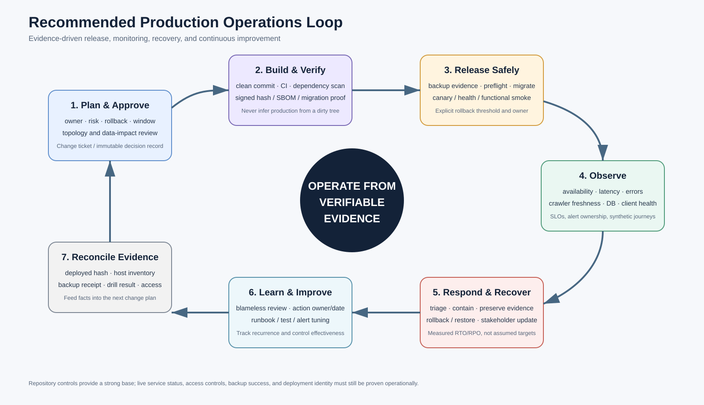

# MoonCen 운영 가이드

## 0. 문서 목적과 안전 경고

이 문서는 MoonCen 운영자가 정상 상태 확인, 배포, 크롤러 데이터 반영, 관측, 장애 대응, 백업·복구와 정기 점검에 사용할 기준 절차입니다.

> **중요:** 저장소의 최신 선언은 `cloud/gen1crawler/gen1db`와 `crawlerMode=legacy`입니다. `deploy/ha`와 일부 Cloudflare 문서의 `n100` 명령은 최신 권위 토폴로지와 충돌합니다. 실제 inventory와 승인된 최신 runbook을 확정하기 전에는 `n100` 승격·failover·tunnel 전환 명령을 실행하지 마십시오.

> **중요:** 이 가이드에 나온 상태·일정은 저장소 선언입니다. 실제 production은 배포 commit, systemd, DB role, tunnel, backup receipt로 확인해야 합니다.

파괴 가능 작업은 항상 다음 순서를 따릅니다.

1. change/incident ID와 책임자를 지정합니다.
2. exact 대상 host·service·DB·batch·release ID를 읽기 전용으로 확인합니다.
3. backup/rollback evidence와 중단 기준을 확인합니다.
4. 두 번째 검토자가 명령과 대상을 확인합니다.
5. 실행 후 health·기능·데이터 무결성과 audit를 검증합니다.
6. 결과와 시간, actor, artifact, rollback 여부를 기록합니다.



---

## 1. 운영 권위와 증거 우선순위

충돌이 있을 때 다음 순서로 판단합니다.

1. **실제 관측 증거**: 접속한 host identity, systemd, process, port, DB role/recovery, deployed tree SHA
2. **승인된 release evidence**: signed release manifest, commit/tree SHA, migration checksum, artifact digest
3. **desired authority**: version 관리된 `config/production_topology.json`
4. **활성 runbook**: topology revision, owner, review date가 있는 문서
5. **설명용 문서/README**: 참고 자료; 실제 상태와 다르면 authority가 아님

관측 상태가 desired와 다르면 즉시 자동 수정하지 말고 drift로 기록합니다. 사고로 인해 의도적으로 다른지, 미완료 cutover인지, 무단 변경인지 판단한 뒤 change 절차를 시작합니다.

### 1.1 모든 운영 증적의 공통 식별자

가능하면 다음 ID를 한 기록에 묶습니다.

- incident 또는 change ID
- Git commit SHA / tree SHA / release ID
- topology revision
- DB migration ledger checksum
- crawler batch/provider/attempt ID
- staging dry-run fingerprint / apply ID
- backup ID / restore drill ID
- API request ID / Ops job ID / deployment ID
- actor, approver, target node, start/end time

---

## 2. 선언된 노드·서비스 책임

| 노드/영역 | 선언 역할 | 주 운영 확인 | 주의사항 |
|---|---|---|---|
| `cloud` | Nginx, frontend2, FastAPI, primary PostgreSQL/PostGIS, AI | public/local health, service status, DB writable role, disk, deployment SHA | 최신 manifest에 DB standby가 없음; 사용자·DB SPOF 가능 |
| `gen1crawler` | legacy crawler owner, crawler timer, staging apply 계열 | provider config, running process, last complete batch, timer, apply | 실제 write mode와 staging/control endpoint를 증거화해야 함 |
| `gen1db` | desired staging DB와 crawler control | DB health, role, backup, scheduler/control metrics | 실제 cutover 완료를 저장소가 증명하지 않음 |
| `bot` | Prometheus, Grafana, 선택적 Uptime Kuma | target/alert/notification, retention, disk | bot 자체 장애를 외부 dead-man이 감시해야 함 |
| `wtr-linux` | disabled distributed canary worker, Ollama 후보 | worker disabled, unexpected process 없음, AI endpoint health | distributed activation 금지 gate 유지 |
| NAS | encrypted/signed backup | latest age, manifest/signature, remote copy, restore test | 단일 failure domain이면 offsite immutable copy 필요 |
| Ops origin | ops-console/API/agent 접근 | Access/VPN/MFA, RBAC, session, audit, SSE | public host와 분리; 실제 외부 접근 통제 확인 |

### 2.1 외부 의존성

| 의존성 | 영향 | 점검 항목 | 장애 시 기본 대응 |
|---|---|---|---|
| 제공기관 사이트 | 데이터 freshness/coverage | HTTP status, parser error, robots/정책, 응답 변화 | provider 격리, partial/zero 처리, close-missing 금지 |
| Cloudflare Tunnel/DNS | public/ops 접근 | tunnel status, route, Access, certificate | local service와 edge를 분리 진단; 승인된 route만 전환 |
| Kakao Maps/Local API | 지도·geocode | key restriction, quota, JS/REST error | 검색은 유지하고 지도/좌표 기능 degrade |
| Google/Naver OAuth | 로그인 | config, callback, state/PKCE, provider status | 기존 세션 유지 여부 확인, 신규 login 공지 |
| SMTP | bug report | TLS, auth, send error | queue/기록 보존, UI에 비밀 없는 오류 표시 |
| Ollama/Gemini | AI tag 보강 | endpoint/TLS, latency, quota, error | deterministic fallback, AI write 일시 중지 |
| NAS/offsite | backup/restore | 연결, 공간, immutable retention | local dump 보존 정책과 2차 target 사용 |
| Telegram/alert channel | incident page | test notification, contact ownership | 두 번째 독립 채널 사용 |

---

## 3. 최초 운영 기준선 확인

새 담당자 인수, 대규모 변경 전, 문서 drift 의심 시 수행합니다. 모든 명령은 해당 권한과 승인 아래 **읽기 전용**으로 실행합니다.

### 3.1 저장소 기준선

```bash
git rev-parse HEAD
git status --short
git diff --stat
```

확인할 것:

- production release의 commit/tree SHA와 일치하는지
- 운영 파일이 untracked인지
- 실행 중인 server가 이 workspace를 직접 참조하는지, immutable release tree를 참조하는지
- CI가 실행한 exact workflow revision이 무엇인지

dirty workspace의 결과를 production 사실로 기록하지 않습니다.

### 3.2 노드 identity와 role

각 노드에서 최소 다음을 수집합니다.

```bash
hostname --fqdn
cat /etc/mooncen-node-role
systemctl list-units --type=service --type=timer 'mooncen-*' --no-pager
systemctl list-timers 'mooncen-*' --all --no-pager
ss -lnt
```

비밀값은 수집하지 않습니다. `/opt/mooncen/.env`를 직접 첨부하지 말고 설치된 helper가 있으면 다음과 같이 redacted output만 사용합니다.

```bash
mooncenctl env
```

### 3.3 애플리케이션 상태

일반 application node:

```bash
mooncenctl summary
mooncenctl status
mooncenctl health
mooncenctl doctor
mooncenctl functional-test-status
mooncenctl cloudflare-gate-status
```

crawler owner:

```bash
mooncenctl summary
mooncenctl status
mooncenctl staging-status
mooncenctl logs crawler
mooncenctl logs staging-apply
```

backup owner:

```bash
mooncenctl backup-status
mooncenctl backup-list
```

명령이 현재 node role에서 거부되면 우회하지 않습니다. 다른 node의 역할을 잘못 지정했거나 helper가 잘못 설치됐을 수 있으므로 inventory drift로 처리합니다.

### 3.4 DB 증거

DB owner 또는 승인된 read-only helper로 다음을 확인합니다.

- 서버 identity와 DB host
- `current_user`, API/crawler/applier/control 역할 분리
- `pg_is_in_recovery()`와 writable 여부
- migration ledger의 최신 ID/checksum
- 주요 schema/table/column readiness
- staging/control DB와 primary DB가 의도대로 분리됐는지
- backup source DB가 expected primary인지

비밀 URL이나 password를 ticket/log에 남기지 않습니다. 임의 raw `psql` 대신 `mooncenctl summary`, 승인된 role helper와 검토된 query를 우선 사용합니다.

### 3.5 crawler 쓰기 모드

다음을 한 번에 증거화합니다.

- `crawlerMode` desired 값: 현재 선언은 `legacy`
- 실제 `CRAWL_WRITE_MODE`
- crawler DB endpoint/role
- 최근 crawler batch와 staging row
- 최근 dry-run/apply ID와 primary 변경
- distributed worker enabled/active 여부

실제 write mode가 불명확하거나 desired와 다르면 다음 수집을 중단하고 change owner가 경계를 확정할 때까지 primary write를 확대하지 않습니다.

---

## 4. 권장 SLO·RPO·RTO 초안

다음은 **현재 보장값이 아니라 첫 30일 baseline 후 승인할 제안값**입니다.

| 대상 | 제안 목표 | 측정 방식 | 비고 |
|---|---|---|---|
| public availability | 월 99.9% | 외부 failure domain의 검색/상세 synthetic journey | `/health`만으로 판단하지 않음 |
| 강좌 검색 latency | p95 1초, p99 2.5초 이내 | edge→API end-to-end | 30일 baseline 후 조정 |
| API server error | 5xx 0.5% 미만 | route group별 중앙 집계 | client 4xx와 분리 |
| crawler freshness | 마지막 complete batch 36시간 이내 | 현재 alert 기준과 정렬 | partial/zero는 성공으로 보지 않음 |
| staging promotion | 승인 batch apply 1시간 이내 또는 명시적 hold | batch/fingerprint/apply audit | 급락·quality block은 예외로 기록 |
| backup | 매일 성공, 30시간 이상 stale 시 page | signed remote receipt | server timezone 확인 |
| restore test | 월 1회 성공 | isolated restore ID와 검증 결과 | DB-only와 full DR을 구분 |
| RPO | 일일 dump만이면 최악 약 24시간 가능 | backup interval/restore drill | business 승인 필요; PITR 시 단축 |
| RTO | 실측 전 미정 | 분기 full-stack DR stopwatch | 임의 숫자를 보장하지 않음 |

SLO owner, budget 소비 알림, maintenance 제외 규칙, 데이터 source를 함께 승인해야 합니다.

---

## 5. 정기 운영 체크리스트

### 5.1 매일

- [ ] public web, `/live`, `/health`, 대표 검색/상세 synthetic 성공
- [ ] API/frontend unit과 Cloudflare gate 정상
- [ ] last complete crawler batch가 36시간 이내
- [ ] partial/zero/failed provider, close-missing block, apply failure 확인
- [ ] backup 최신 age, size, signature/manifest, remote copy 성공
- [ ] critical alert 미처리 건과 on-call owner 확인
- [ ] disk/memory/CPU, DB connection/lock, certificate 만료 임박 확인
- [ ] unexpected distributed worker 또는 퇴역 node traffic 없음

### 5.2 매주

- [ ] desired/observed topology drift
- [ ] deployed commit/tree와 release manifest 정합성
- [ ] provider별 freshness·수집량·parser 오류 추세
- [ ] staging backlog와 승인 hold 이유
- [ ] API p95/p99, 5xx, DB slow/lock/pool 추세
- [ ] dependency/quota/OAuth/SMTP/Kakao/AI error 추세
- [ ] Ops audit의 실패·거부·파괴 작업 검토
- [ ] backup 용량·retention·offsite copy·alert test
- [ ] pending monitoring target에 owner와 due date 존재

### 5.3 매월

- [ ] restore test가 최신 backup으로 성공했는지와 실측 시간 확인
- [ ] Access/MFA/session/break-glass와 운영자 권한 검토
- [ ] secret/key/certificate 만료와 rotation 일정
- [ ] OS/runtime/DB/package 보안 업데이트와 EOL
- [ ] runbook owner/review date/topology revision
- [ ] capacity, DB/index/table growth, Prometheus/log retention
- [ ] flaky test, coverage, CI bypass, manual deployment exception
- [ ] 레거시·미사용 table/config/worker 정리 backlog

### 5.4 분기

- [ ] full-stack DR 또는 승인된 부분별 game day
- [ ] cloud loss, DB corruption, NAS unavailable, bot monitoring loss 시나리오
- [ ] crawler release/rollback과 staging apply fingerprint drill
- [ ] Ops 권한·CSRF·replay·파괴 작업 승인 penetration scenario
- [ ] provider 약관/API 정책, 개인정보·AI data flow review
- [ ] SLO/RPO/RTO와 HA/restore-only ADR 재검토

---

## 6. 일정과 timer 관리

저장소의 systemd timer 선언은 다음과 같습니다.

| 작업 | 선언 schedule | 확인 단위 |
|---|---|---|
| legacy crawler | 매일 22:00 `Asia/Seoul` | `mooncen-crawler.timer` |
| staging apply | hourly | `mooncen-staging-apply.timer` |
| backup | 매일 03:30 + 최대 15분 random delay | `mooncen-backup.timer` |
| restore test | monthly + 최대 6시간 random delay | `mooncen-backup-restore-test.timer` |
| functional test | 매일 08:20 + 최대 10분 random delay | `mooncen-functional-test.timer` |
| Cloudflare health gate | 60초마다 | `mooncen-cloudflare-gate.timer` |
| role guard | 1분마다 | `mooncen-cloudflared-role-guard.timer` |
| control metrics | 매분 | distributed target용; legacy mode 상태 확인 |

`OnCalendar`에 timezone이 없는 작업은 server local timezone의 영향을 받습니다. 실제 다음 실행 시각은 다음으로 확인합니다.

```bash
timedatectl
systemctl list-timers 'mooncen-*' --all --no-pager
```

timer가 `enabled`여도 마지막 service result가 실패할 수 있으므로 `LastTriggerUSec`, service result와 최근 journal을 함께 봅니다.

---

## 7. 정상 배포 runbook

### 7.1 진입 조건

- approved change ID와 owner/approver
- clean reviewed commit, protected branch/tag
- 전체 필수 CI 성공
- signed artifact/release manifest와 expected tree SHA
- migration 목록·호환성·forward-fix 또는 rollback 정책
- 최근 backup/restore evidence가 정책상 유효
- active incident 없음 또는 incident commander 승인
- crawler batch/apply와 겹치지 않는 window
- rollback release와 중단 threshold 준비

### 7.2 preflight

운영자 PC의 검토된 wrapper 예:

```powershell
.\deploy_mooncen.ps1 preflight
.\deploy_mooncen.ps1 targets
.\deploy_mooncen.ps1 status
.\deploy_mooncen.ps1 doctor
```

서버에서는 다음을 확인합니다.

```bash
mooncenctl summary
mooncenctl doctor
mooncenctl backup-status
systemctl list-timers 'mooncen-*' --all --no-pager
```

preflight가 dirty tree, 예상하지 않은 HEAD, SSH host key, health, node role, crawler activity, release hash에서 실패하면 우회하지 않습니다.

### 7.3 배포

정확한 명령과 target은 승인된 최신 배포 문서를 사용합니다. 기본 원칙은 다음과 같습니다.

1. exact commit을 archive합니다.
2. local/remote archive SHA와 release tree SHA를 비교합니다.
3. dependency hash와 frontend digest를 검증합니다.
4. immutable release directory에서 prebuild/preflight를 수행합니다.
5. release guard lock/journal 아래 service를 정지하고 atomic rename으로 전환합니다.
6. DB migration은 단일 authority인 `DB/setup_db.py --mode migrate`를 release 절차에서 한 번만 실행합니다.
7. service를 시작하고 local health, Nginx health, functional journey를 확인합니다.
8. release manifest와 deployed provenance를 기록합니다.

직접 migration을 수동 실행해야 하는 예외 상황에서도 다음 명령은 승인된 owner, 검증된 env, backup과 exact release 아래에서만 사용합니다.

```bash
python DB/setup_db.py --mode migrate
```

별도의 Alembic 등 두 번째 migration authority를 병행하지 않습니다.

### 7.4 배포 후 검증

```bash
mooncenctl status
mooncenctl health
mooncenctl doctor
mooncenctl functional-test
mooncenctl functional-test-status
mooncenctl cloudflare-gate-status
```

추가 검증:

- expected commit/tree/frontend digest와 실제 값
- `/live`와 `/health` 의미 분리
- 대표 강좌 검색, 상세, SEO route, 지점 근거리 API
- OAuth config/state 발급; 실제 login은 test account 정책에 따름
- API가 owner가 아닌 전용 DB role 사용
- migration ledger checksum
- 5xx/latency/DB lock과 client error 증가 없음
- crawler/staging schedule가 중복 또는 정지되지 않음

### 7.5 중단·rollback 기준

다음 중 하나면 신규 변경을 중단하고 incident/change owner가 rollback 또는 forward-fix를 결정합니다.

- tree SHA/provenance 불일치
- migration checksum 또는 role/grant 불일치
- `/health` 또는 대표 기능 실패
- 5xx·latency·DB lock이 승인 threshold 초과
- 데이터 row delta/lifecycle 변경이 예상 범위 초과
- crawler·apply 중복 실행
- auth/CSRF/Ops boundary regression
- release guard journal이 incomplete 상태

schema가 이미 비호환 변경됐다면 코드만 rollback하지 않습니다. expand-contract를 전제로 직전 app 호환 여부를 확인하고, 불가능하면 승인된 forward-fix를 사용합니다.

---

## 8. crawler 운영 runbook

### 8.1 현재 상태 원칙

- desired mode: `legacy`
- primary crawler owner: `gen1crawler`
- distributed worker: 모두 disabled
- distributed 활성화: 별도 go/no-go change 전 금지
- 실제 write path: 최초 기준선에서 반드시 확인

### 8.2 정상 상태 확인

```bash
mooncenctl summary
mooncenctl status
mooncenctl staging-status
mooncenctl logs crawler
mooncenctl logs staging-apply
```

확인 항목:

- timer active/enabled, last run result
- running provider와 stale process
- requested/success/failed provider 수
- complete/partial/zero/failed 결과
- last terminal completion이 36시간 이내
- staging batch ID, scope, completeness, row count
- dry-run/apply result와 fingerprint
- primary lifecycle close block과 급락 경보

### 8.3 수집 실패 판정

| 상태 | 처리 |
|---|---|
| 한 provider 실패 | provider 격리, partial 표시, 실패 owner row 제외; 전체 성공으로 표시 금지 |
| zero provider | source/registry/config/DB 경계 확인; close-missing 금지 |
| 수집량 급락 | source UI/API 변경인지 확인; apply와 lifecycle close hold |
| timeout/stale process | process tree와 lock 확인; 무작정 두 번째 run 시작 금지 |
| batch ownership/fingerprint 오류 | evidence 변경 원인 조사; 새 dry-run과 재승인 |
| staging DB 불가 | primary direct-write로 우회 금지; write policy에 따라 중지 |

### 8.4 staging dry-run과 apply

`mooncenctl`은 role-scoped helper로 검증·반영을 호출합니다.

```bash
mooncenctl staging-dry-run
```

dry-run 결과에서 다음을 검토합니다.

- exact batch/provider 범위
- collection completeness와 실패 owner
- branch/course insert/update/close 예상 수
- 과거 대비 감소율과 close-missing eligibility
- validation error와 control approval
- snapshot/fingerprint SHA

적용은 production 변경입니다. change ID, approver, fingerprint, backup evidence가 모두 있을 때만 승인된 절차로 수행합니다.

```bash
mooncenctl staging-apply
```

최신 batch를 무비판적으로 선택하지 말고 helper가 exact reviewed fingerprint와 batch를 고정하는지 확인합니다. apply 후 primary row count, sample course, lifecycle, API search와 audit log를 검증합니다.

### 8.5 crawler 수동 실행

```bash
mooncenctl crawler-once
```

수동 실행 전 timer/active process/lock과 대상 provider 범위를 확인합니다. 정규 schedule과 중복되거나 close-missing을 유발할 수 있는 sample/partial run은 금지합니다. 실행 사유, provider, expected scope와 결과를 기록합니다.

### 8.6 분산 전환 금지 조건

다음 중 하나라도 충족되지 않으면 worker를 enable하지 않습니다.

- clean signed crawler release
- control/staging DB backup과 성공 restore receipt
- worker bootstrap/signature/fencing/lease expiry test
- canary provider와 row-level 결과 비교
- scheduler/finalizer/approver 역할 분리
- queue/dead-letter/heartbeat/freshness/apply alert
- legacy scheduler stop·rollback 절차
- topology/monitoring/runbook의 원자적 revision

---

## 9. DB migration 운영

### 9.1 원칙

- `DB/setup_db.py`가 canonical migration authority입니다.
- 적용된 migration 파일을 수정하지 않습니다. checksum 불일치는 사고로 처리합니다.
- production owner/migrator와 API/crawler/applier role을 분리합니다.
- migration은 backup evidence와 production-like rehearsal을 통과해야 합니다.
- 가능하면 expand → app deploy → backfill → contract 순으로 진행합니다.

### 9.2 preflight

- expected migration ID/checksum
- 예상 lock/scan/table rewrite와 소요시간
- disk 여유와 DB connection/pool
- 직전 app/new schema 호환성
- rollback 가능한 DDL인지, 불가능하면 forward-fix
- crawler/apply/AI write 중지 필요성
- backup ID와 restore rehearsal

### 9.3 post-check

- migration ledger와 schema objects
- role/grant contract
- `/health` readiness
- representative search/PostGIS/full-text query
- API 5xx/latency와 DB lock/timeout
- crawler staging/apply와 AI update 권한

---

## 10. 백업·복구 운영

### 10.1 매일 확인할 backup evidence

- backup ID와 source DB identity
- start/end time와 exit status
- dump/reference archive 크기
- age encryption 성공
- Ed25519 manifest signature와 SHA-256 검증
- strict SSH host key와 remote copy 성공
- remote object 존재·크기
- retention 결과와 삭제 대상
- metric/alert 발행

```bash
mooncenctl backup-status
mooncenctl backup-list
```

파일이 존재한다는 사실만으로 성공으로 판정하지 않습니다. 암호 해제, signature, dump parse와 restore test가 필요합니다.

### 10.2 월간 restore test

승인된 non-production isolated 대상에서 다음을 검증합니다.

```bash
mooncenctl backup-test
```

- latest backup 허용 age
- signature/hash/size
- candidate DB 생성과 schema/migration
- row counts, constraints, PostGIS, representative query
- application health와 functional journey 가능 여부
- elapsed time와 예상 RTO 비교
- test DB/secret의 안전한 정리

### 10.3 production restore

production restore는 파괴 가능 작업이므로 이 문서의 짧은 명령으로 실행하지 않습니다. `docs/synology-backup-restore.md`의 최신 승인 revision과 exact backup ID를 사용하고 두 번째 승인자가 필요합니다.

권장 단계:

1. incident commander와 DBA가 손상 범위·write freeze를 결정합니다.
2. 현재 DB와 로그를 증거로 보존합니다.
3. source backup의 identity/signature와 복구 목표 시각을 승인합니다.
4. candidate DB에 복구하고 독립 검증합니다.
5. application/crawler/AI/apply write를 정지합니다.
6. DB name swap 또는 승인된 endpoint 전환을 수행합니다.
7. local/public health와 주요 journey를 검증합니다.
8. 실패 시 기존 DB로 원복합니다.
9. 성공 후 old DB 삭제는 보존 기간과 사고 증거 정책을 확인한 뒤 별도 승인합니다.

### 10.4 full DR

DB restore와 전체 서비스 복구를 구분합니다. 분기 drill은 새 host/계정/secret, application artifact, Nginx/systemd, Cloudflare tunnel/DNS, monitoring, functional journey까지 포함해야 합니다.

---

## 11. 관측·알림 운영

### 11.1 severity

| 등급 | 기준 | 예 | 초기 대응 목표 제안 |
|---|---|---|---|
| SEV1 | 광범위 사용자 중단, 데이터 손실/무결성, active security incident | primary DB 불가/손상, 잘못된 대량 close, credential 침해 | 즉시 page, 15분 내 commander |
| SEV2 | 핵심 기능 저하 또는 임박한 데이터/가용성 위험 | 5xx 급증, crawler 36시간 stale, backup 연속 실패, disk 임계 | 15분 내 page, 30분 내 owner |
| SEV3 | 제한적 기능·한 provider·비긴급 drift | provider parser 실패, pending target, 문서 drift | 업무시간 triage |
| SEV4 | 개선·정보 | capacity 추세, deprecation | backlog |

실제 response target은 on-call 인력과 사업 요구에 맞춰 승인합니다.

### 11.2 alert 품질

모든 alert에는 다음이 있어야 합니다.

- 사용자/데이터 영향
- exact service/node/provider/batch
- 최초 확인 query 또는 dashboard
- runbook link와 owner
- silence 조건·최대 기간
- 자동 recovery notification
- 반복 alert의 root-cause action

alert가 firing하지 않는 것이 건강을 의미하지 않습니다. collector freshness, target status, rule evaluation, notification channel과 외부 dead-man을 함께 검사합니다.

### 11.3 로그 확인

```bash
mooncenctl logs api
mooncenctl logs frontend
mooncenctl logs crawler
mooncenctl logs staging-apply
mooncenctl logs ai
mooncenctl logs nginx
mooncenctl logs cloudflared
```

요청 URL query, token, OAuth code, 개인정보를 ticket에 복사하지 않습니다. request ID, batch ID, job ID, release ID로 필요한 범위만 수집합니다.

---

## 12. 장애 대응 공통 절차

### 12.1 단계

1. **감지**: 사용자 영향, 시작 시각, 증거 source를 확인합니다.
2. **지휘**: severity, incident commander, 기술 owner, 기록자를 지정합니다.
3. **변경 동결**: 관련 deploy, crawler, apply, migration, AI write를 필요 범위만 중지합니다.
4. **증거 보존**: release/tree SHA, systemd/journal, DB state, batch/apply/backup ID를 보존합니다.
5. **범위 축소**: edge/app/API/DB/provider/control/backup 중 failure domain을 분리합니다.
6. **완화**: rollback, feature disable, provider isolation, read-only, restore 중 가장 작은 안전 조치를 선택합니다.
7. **검증**: health뿐 아니라 대표 사용자 journey와 데이터 무결성을 확인합니다.
8. **소통**: 알려진 사실, 사용자 영향, 다음 update 시각을 전달합니다.
9. **복구 종료**: monitoring 안정 기간과 backlog 처리까지 확인합니다.
10. **사후 검토**: 2~5영업일 내 원인, 통제 실패, owner/due date를 기록합니다.

### 12.2 공지 템플릿

```text
[SEV/Incident ID] MoonCen <영향 영역>
- 시작/감지: <UTC/KST 명시>
- 사용자 영향: <확인된 사실만>
- 현재 상태: 조사/완화/복구/모니터링
- 변경 동결 범위: <deploy/crawler/apply 등>
- 다음 업데이트: <시각>
- 담당: <commander / technical owner>
```

---

## 13. 주요 장애 시나리오

### 13.1 public 접속 불가

1. 외부 synthetic와 `mooncenctl health`를 비교합니다.
2. local API direct, Nginx, frontend direct, Cloudflare tunnel 순서로 failure domain을 분리합니다.
3. DB readiness와 disk/CPU/connection을 확인합니다.
4. edge만 문제면 승인되지 않은 DB/HA 전환을 하지 않습니다.
5. Cloudflare route 전환은 최신 topology runbook과 두 번째 승인 아래 수행합니다.

### 13.2 API health 실패, live 성공

readiness dependency 문제로 봅니다. DB endpoint/role/TLS/schema와 crawler-control required state를 확인합니다. service restart를 반복하기 전에 DB lock/migration/connection failure의 원인을 보존합니다.

### 13.3 DB primary 장애 또는 손상

1. application/crawler/AI/apply write를 동결합니다.
2. 실제 primary identity와 `pg_is_in_recovery()`를 확인합니다.
3. 과거 `n100` promotion 명령을 사용하지 않습니다.
4. 승인된 HA ADR이 있으면 fencing 후 해당 runbook을 따릅니다.
5. 없으면 restore-only 절차로 exact backup/PITR target을 결정합니다.
6. old primary를 격리하지 않은 채 새 primary를 writable로 만들지 않습니다.

### 13.4 crawler stale/partial/zero

1. 마지막 complete batch와 provider별 결과를 확인합니다.
2. source site, network, parser/config, browser, DB/staging을 분리합니다.
3. partial/zero에서는 close-missing을 허용하지 않습니다.
4. 한 provider 실패는 격리하고 나머지 결과를 정확히 partial로 기록합니다.
5. 데이터 감소가 실제 source 변화인지 확인될 때까지 apply를 hold합니다.

### 13.5 잘못된 staging apply 의심

1. 추가 apply와 crawler lifecycle write를 중지합니다.
2. batch/provider/fingerprint/apply log와 primary row delta를 보존합니다.
3. 임의 SQL로 즉시 덮어쓰지 않습니다.
4. previous snapshot/backup과 안전한 compensating batch 또는 DB restore를 비교합니다.
5. 사용자 노출 차단이 필요하면 가장 작은 content/status override를 승인합니다.

### 13.6 backup 실패

1. source DB, local disk, encryption/signing, SSH/NAS, remote space 단계로 분리합니다.
2. 실패 산출물을 성공으로 rename/표시하지 않습니다.
3. last known good backup age가 RPO를 넘기면 SEV2 이상으로 올립니다.
4. retry가 source DB 성능을 해치지 않도록 window와 I/O를 확인합니다.
5. 독립 target이 있으면 승인된 copy를 수행하고 원인·복구를 기록합니다.

### 13.7 Ops 계정 또는 secret 침해

1. 해당 session/token/key를 폐기하고 logout-all/Access 차단을 수행합니다.
2. audit/job/deployment/content override와 DB write 범위를 보존합니다.
3. 관련 OAuth/SMTP/Kakao/Cloudflare/AI/DB credential을 의존 순서대로 rotate합니다.
4. secret을 ticket/chat에 붙이지 않습니다.
5. 재개 전 MFA, role, nonce/replay, fixed action과 배포 provenance를 검증합니다.

### 13.8 monitoring 자체 장애

외부 dead-man과 public synthetic를 기준으로 수동 관측 모드로 전환합니다. bot disk/container/network, Prometheus rule evaluation, Grafana contact point를 분리하고 복구될 때까지 정해진 주기로 수동 health/crawler/backup 확인을 기록합니다.

---

## 14. 접근·secret·계정 운영

- 사람 계정과 service account를 공유하지 않습니다.
- DB owner/migrator/API/crawler/applier/AI/check/control 역할을 합치지 않습니다.
- Ops는 Access/VPN+MFA, 짧은 세션과 최소 역할을 적용합니다.
- root-owned env/systemd credential와 외부 secret store의 소유권·mode를 정기 검증합니다.
- secret은 job parameter, command line, Git, journal, browser storage에 넣지 않습니다.
- rotation은 producer와 consumer 순서, overlap 기간, rollback key, verification을 계획합니다.
- break-glass는 sealed/escrowed, 사용 시 즉시 page/audit, 사용 후 rotate합니다.
- 퇴사·역할 변경 시 SSH, Access, Ops, DB, cloud, NAS, OAuth/스토어 권한을 하나의 checklist로 회수합니다.

---

## 15. 운영 변경 유형별 승인 수준

| 변경 | 최소 검토 | 추가 증거 |
|---|---|---|
| 문서·dashboard | 영역 owner 1인 | link/config validation |
| 일반 app release | 코드 reviewer + release approver | clean CI, artifact, health, rollback |
| DB migration | DBA + app owner + release approver | snapshot rehearsal, backup, lock/compatibility |
| crawler code/config | data owner + release approver | provider scope, staging canary, close policy |
| staging apply | data reviewer + applier 분리 | exact batch/fingerprint, delta, backup policy |
| Ops 권한/Access | security + platform owner | role matrix, MFA, audit test |
| backup/retention/key | DBA + security | restore test, escrow, immutable copy |
| DB failover/restore | incident commander + DBA + second approver | fencing, exact target, RTO/RPO, rollback |
| distributed activation | data/platform/DB/security 공동 승인 | DIST-01 전체 gate evidence |

---

## 16. 사후 검토 템플릿

```text
Incident ID / 제목:
기간(UTC/KST):
Severity / 사용자·데이터 영향:
감지 경로와 감지 지연:
권위 release/topology/batch/backup ID:

사실 기반 타임라인:
- HH:MM ...

직접 원인:
기여 요인:
왜 기존 통제가 막지 못했는가:
완화·복구와 실측 시간:
데이터 무결성 검증:

후속 조치:
- [owner / due date / priority] 예방
- [owner / due date / priority] 탐지
- [owner / due date / priority] 복구

runbook/test/alert/architecture 갱신:
재발 여부를 판단할 지표:
```

사후 검토는 개인의 실수에서 끝내지 않고 권위, guard, test, alert, 승인, 복구가 왜 실패했는지 설명해야 합니다.

---

## 17. 현재 저장소에서 우선 보완할 운영 항목

1. 실제 배포 revision과 대량 workspace 변경의 관계를 확정합니다.
2. `n100` 과거 HA 문서를 archive하고 최신 topology로 tabletop을 수행합니다.
3. actual crawler write mode와 `gen1db` cutover 상태를 증거화합니다.
4. `gen1crawler` exact-commit code release/rollback 경로를 완성합니다.
5. backup/restore freshness와 monitoring dead-man을 외부 failure domain에 연결합니다.
6. 서비스별 RPO/RTO와 HA 대 restore-only를 승인합니다.
7. API RED, DB pool/lock/query, crawler/apply, AI backlog를 중앙 집계합니다.
8. Ops Access/MFA와 모든 server-side mutation 권한을 검증합니다.
9. clean signed CI artifact만 production에 배포하도록 통합합니다.
10. distributed control은 모든 go/no-go 증거가 충족될 때까지 비활성으로 유지합니다.

---

## 18. 주요 참고 파일

- 배포: `deploy/ubuntu/DEPLOY.md`, `deploy_mooncen.ps1`, `deploy/ubuntu/deploy_from_windows.ps1`
- 운영 CLI: `deploy/ubuntu/mooncenctl.sh`
- desired topology: `config/production_topology.json`, `docs/multi-server-deployment.md`
- distributed gate: `docs/distributed-crawler-control-plane.md`
- Nginx: `deploy/ubuntu/nginx/mooncen.conf`, `deploy/ops-console/nginx/`
- systemd/timer: `deploy/ubuntu/systemd/`
- monitoring: `deploy/monitoring/`
- backup/restore: `docs/synology-backup-restore.md`, `deploy/backup/`
- crawler orchestration: `run_crawlers.py`
- staging apply: `tools/apply_staging_batch.py`
- DB migration/role: `DB/setup_db.py`, `DB/roles_body.sql`
- Ops: `docs/ops-console.md`, `backend/routers/ops_v2.py`, `ops_agent/`
- 충돌하는 과거 HA 자료: `deploy/ha/README.md`, `deploy/ha/CLOUD_PRIMARY_N100_STANDBY.md`

