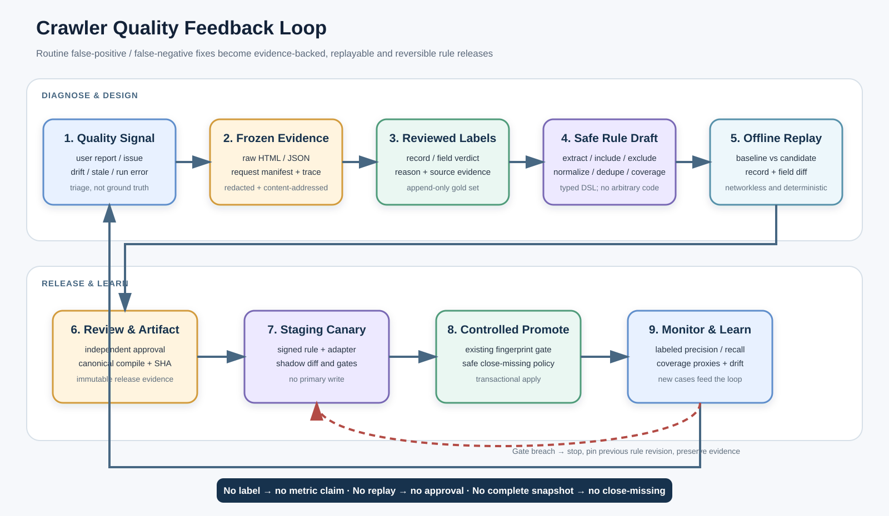

# MoonCen 크롤러 품질 아키텍처 간략본

> 결론: 오탐·미탐 수정 속도를 높이려면 “소스 편집기”보다 **증거·정답셋·리플레이·영향 비교·승인·롤백이 연결된 품질 Workbench**가 먼저 필요하다. 일상적인 동작은 안전한 Rule Pack으로, 복잡한 통신은 검토된 Adapter 코드로 분리한다.

## 1. 왜 지금 수정이 어려운가

현재 규칙의 실질적인 위치가 한 곳이 아니다.

| 변경 종류 | 현재 주된 위치 | 현재 어려움 |
|---|---|---|
| 대상·상태·URL | 여러 YAML registry/target 파일 | schema와 실제 runtime 소비 범위가 일치하지 않음 |
| 공통 의미 필터 | `course_title_quality`, `generic_course_eligibility`, `course_semantic_eligibility` | 전 provider 영향 분석이 필요함 |
| generic 추출·필터 | `Crawler_MunicipalYaml.py` | 60,610줄 파일의 공통 로직과 사업자 분기가 결합됨 |
| 사업자별 예외·페이지 처리 | Municipal 거대 dispatch 및 개별 crawler Python | 수정 지점을 찾고 회귀 범위를 판단하기 어려움 |
| 품질 검출 | 고정 SQL 규칙, 품질 점수 | 필드 존재/범위는 보지만 독립적인 FP/FN 정답은 아님 |
| Studio 검토 | append-only Python 소스 revision | 초안에 결박된 fixture replay/build/deploy가 없음 |

이미 출판 직전 semantic fail-closed 판정과 reason/evidence 기록, snapshot completeness, 정규화 행 staging, fingerprint 기반 승격 방어는 있다. 새 구조는 이를 대체하지 않고 앞단의 **재현 가능한 품질 판단**을 추가한다.

## 2. 목표 업무 흐름

1. 사용자 신고, 품질 이슈, source drift, 실행 오류를 **사례(case)** 로 모은다.
2. 해당 시점의 HTML/JSON, 요청 manifest, candidate trace를 동결·비식별화한다.
3. 검수자가 행/필드별 정답과 reason을 라벨링한다.
4. 운영자는 폼 중심 Rule Builder에서 include/exclude/extract/normalize/dedupe/coverage를 수정한다.
5. 동일 fixture에 기존 rule과 후보 rule을 네트워크 없이 재실행한다.
6. 행/필드 차이, FP/FN, 완전성, 보안 gate를 통과해야 검토로 보낸다.
7. 작성자와 다른 승인자가 canonical rule artifact를 승인한다.
8. legacy + staging 환경에서 shadow/canary를 거쳐 기존 promotion gate로 승격한다.
9. 이상 시 이전 rule revision을 즉시 고정하고, 이미 반영된 데이터는 별도 보정 batch로 복구한다.

## 3. 목표 컴포넌트

### Quality Workbench

- **Quality Inbox**: provider 개선 큐, 사용자 제보, 품질 이슈, source drift를 하나의 case로 관리
- **Evidence Viewer**: 원본/후보/정규화 값과 필드 근거 위치를 나란히 표시
- **Guided Rule Builder**: 폼 편집을 기본으로 하고, 검증된 YAML을 고급 보기로 제공
- **Replay Lab**: baseline/candidate diff, 정답셋 지표, coverage 결과 제공
- **Review & Release**: 독립 승인, artifact digest, canary, rollback 상태 제공

### Quality Control Plane

- 환경에 결박된 Ops API와 append-only control DB
- 암호화된 raw quarantine와 비식별 fixture store
- 네트워크가 없는 replay sandbox
- strict schema, allowlisted operator, 제한 regex/selector를 가진 rule compiler
- rule revision, adapter version, fixture digest, reference clock을 고정한 평가 증거

### 기존 Data Plane 재사용

- Source Adapter → signed Rule Runtime → Crawl Staging → 기존 Promotion Gate → Primary DB
- 첫 단계는 현재 `legacy` 실행과 staging만 사용한다. 비활성 분산 worker를 선행 조건으로 만들지 않는다.

## 4. 무엇을 룰로 바꾸고 무엇을 코드로 남길까

| 상황 | 기본 처리 | 이유 |
|---|---|---|
| 특정 제목/카테고리의 잘못된 포함·제외 | Rule Pack의 classify | 검수·리플레이·롤백이 쉬움 |
| CSS/제한 JSON path, 필드 매핑 | Rule Pack의 extract | 정적 검증과 fixture 재현 가능 |
| 날짜·금액·공백·상태 변환 | allowlisted normalize rule | 결정적 pure transform으로 제한 가능 |
| 중복 identity, provider별 우선 키 | Rule Pack의 identity | 충돌 근거와 영향을 표시할 수 있음 |
| 최소 건수·pagination sentinel·detail 성공률 | Rule Pack의 coverage contract | 미탐 proxy와 close-missing 안전성에 직결 |
| 로그인, 세션/CSRF, JS browser, signed API | Adapter Python 코드 | 상태기계·네트워크 보안은 코드 리뷰가 필요 |
| 전 provider 보안 차단, PII/private route | code-owned global deny | provider rule이 완화할 수 없어야 함 |
| 긴급 단일 레코드 숨김 | 만료 시간이 있는 quarantine/override | 영구 parser 예외로 굳히지 않음 |

룰 우선순위는 `global → adapter family → provider → target → time-bounded emergency` 순으로 합성한다. 같은 우선순위에서 include와 exclude가 충돌하면 자동으로 하나를 택하지 않고 compile 실패 또는 `abstain`으로 처리한다.

## 5. 오탐·미탐을 어떻게 측정하는가

- **행 오탐(FP)**: 실제 비강좌인데 include
- **행 미탐(FN)**: 실제 강좌인데 exclude 또는 production에서 hold되는 abstain
- **필드 오탐**: 행은 맞지만 title/기간/비용/지점/URL 등이 원본과 다름
- **필드 미탐**: 원본에 근거가 있는데 필드가 비어 있음

Precision = `TP / (TP + FP)`, Recall = `TP / (TP + FN)`이다. 단, 이 수치는 최종 검수 라벨이 있는 candidate universe에만 적용한다.

> 중요한 한계: 운영 DB의 출력 행만 보면 필터 전 강좌를 알 수 없어 전체 미탐률을 계산할 수 없다. `advertised total`, 모든 page/partition 방문, empty sentinel, identity reconciliation은 강한 **coverage proxy**이지 그 자체가 ground truth recall은 아니다. 완전한 원천 목록이 없으면 지표명을 `conditional_recall_on_audited_surface`로 표시한다.

## 6. 반드시 지킬 release gate

- snapshot/fixture/rule/adapter digest가 정확히 결박되지 않으면 평가 무효
- 예상 밖 네트워크 요청, nondeterministic output, fixture signature 불일치 시 차단
- PII, applicant/private/authenticated surface가 candidate나 fixture에 포함되면 차단
- critical negative fixture의 FP가 1건이라도 생기면 차단
- 새로 제외되는 unlabeled candidate가 있으면 자동 승인 금지
- coverage contract가 불완전하면 close-missing 금지
- 작성자는 자기 rule revision을 승인하지 못함
- 유효한 signed evaluation evidence 없이는 build/register/canary/promotion 금지

## 7. 단계별 도입

| 단계 | 핵심 결과 | 운영 변화 |
|---|---|---|
| P0 기반 | taxonomy, case/label, 필터 전 candidate trace, release generation 귀속 | 오탐·미탐을 같은 언어와 증거로 기록 |
| P1 MVP | raw snapshot/fixture, networkless replay, baseline/candidate diff, hard gate | 수정 전 회귀와 영향을 재현 가능 |
| P2 편집 | safe Rule Pack/compiler, Guided Rule Builder, staging shadow | 단순 수정의 다수를 Python 변경 없이 처리 |
| P3 확장 | canary worker 연결, drift sampling, conditional data rollback | 점진 배포와 지속 개선 자동화 |

초기 MVP는 **Generated/YAML 또는 generic parser로 처리 가능한 provider**부터 시작한다. 복잡한 dedicated collector를 한 번에 DSL로 옮기지 않는다.

## 8. 성공 기준

- 모든 rule release가 fixture replay, diff, 독립 승인, artifact digest를 가짐
- 일상적인 오탐/미탐 수정의 80% 이상이 Python 변경 없이 처리됨
- 라벨 접수부터 검증 가능한 rule 후보까지의 중앙값이 1영업일 이내
- provider별 labeled precision/recall과 label coverage가 함께 표시됨
- primary 직접 수정 0건, 불완전 snapshot의 close-missing 0건
- 이전 rule revision으로의 운영 rollback이 10분 이내
- release별 품질 결과의 artifact/config/rule/generation 귀속률 100%

수치는 목표 예시다. P0에서 현재 baseline과 운영 인력을 측정한 뒤 확정한다.

## 9. 최종 의사결정

1. Crawler Studio를 임의 Python 실행기로 확장하지 않는다.
2. 품질 Workbench를 기존 control DB·audit·staging·promotion 경계 위에 증설한다.
3. 원본 증거와 정답 라벨을 rule보다 먼저 만든다.
4. true recall과 coverage proxy를 UI·API·보고서에서 다른 이름으로 노출한다.
5. 분산 crawler 활성화와 이 프로젝트의 MVP를 분리한다.

