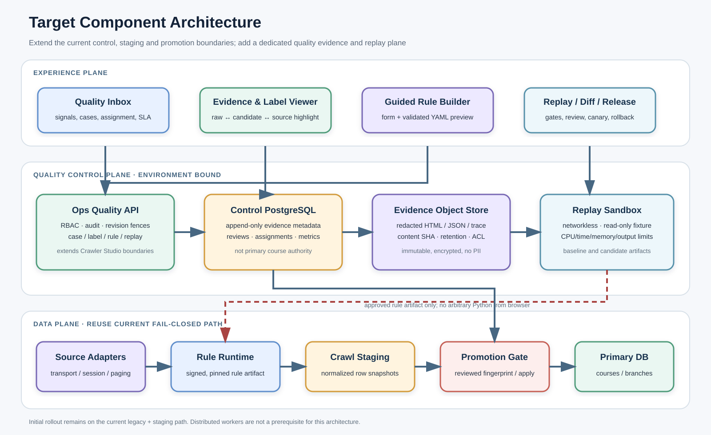
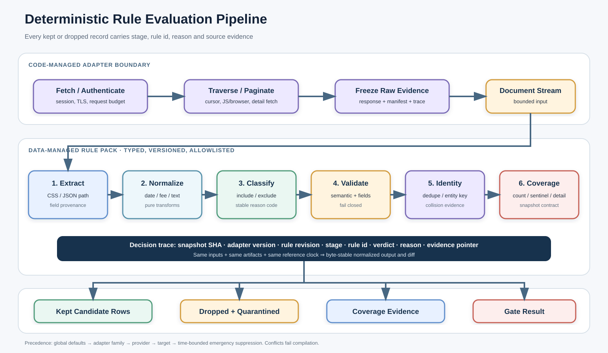

# MoonCen 크롤러 품질 아키텍처 상세본

> 문서 상태: **목표 설계 제안**. 2026-08-19 UTC의 로컬 워크스페이스를 정적으로 분석했다. 실제 운영 DB migration 적용, 실행 서비스, 배포 revision, 원본 사이트 이용 조건은 별도 검증이 필요하다.

## 1. 설계 요약

목표는 개발자가 거대한 parser 분기를 직접 찾아 수정하는 빈도를 줄이면서도, 한 오탐 수정이 다른 provider의 미탐을 만드는 일을 release 전에 발견하는 것이다.

이를 위해 다음 세 책임을 분리한다.

| 계층 | 책임 | 변경 방식 |
|---|---|---|
| Source Adapter | 안전한 요청, 세션/인증, pagination, browser/API protocol, 원본 문서 생성 | 코드 리뷰·테스트·signed artifact |
| Rule Pack | 추출, 정규화, include/exclude/abstain, identity, coverage 계약 | strict schema·guided editor·fixture replay |
| Quality Evidence | snapshot, candidate, label, baseline/candidate diff, 승인 증거 | append-only control plane |

```text
Quality signal
  → immutable sanitized source evidence
  → snapshot-bound human truth
  → safe rule or adapter draft
  → deterministic baseline/candidate replay
  → row/field/coverage/security gates
  → independent approval and signed artifact
  → legacy staging shadow and controlled promotion
  → monitor, pause, rule rollback, data repair
```

이 구조는 현재의 semantic fail-closed, staging, reviewed fingerprint, safe close-missing을 그대로 마지막 방어선으로 유지한다.

## 2. AS-IS: 확인된 현재 구조

### 2.1 설정이 runtime rule의 단일 원천이 아님

`Crawler_GeneratedYamlTargets.py`에는 target 필수 필드와 selector/제한 JSON path 검증이 있다. 그러나 현재 `config/crawl_targets/*.yaml`에서 selector/JSON path 실행 필드 사용은 정적 검색 기준 0건이고, YAML의 `parser_assigned`도 Crawler Python runtime에서 참조되지 않는다. 실제 Municipal parser 선택은 `Crawler_MunicipalYaml.collect_from_url`의 provider/domain 분기가 담당한다.

- target imperative validator: `Crawler/Crawler_GeneratedYamlTargets.py:2791-2889`
- loader와 registry 포함 정책: `Crawler/Crawler_GeneratedYamlTargets.py:2892-3028`
- generic row/filter: `Crawler/Crawler_MunicipalYaml.py:50444-50794`
- provider dispatch hotspot: `Crawler/Crawler_MunicipalYaml.py:54475-58615`
- 현재 파일 크기: 60,610줄

따라서 현재 YAML에 parser 이름이나 selector를 추가하는 것만으로 오탐·미탐 동작을 바꿀 수 없다.

### 2.2 공통 오탐 방어는 강하지만 코드에 고정됨

`course_registration_v1`은 제목, URL, 일정, 신청기간, 신청 링크, 등록 상태, 구조화 필드를 조합해 `eligible/reason/evidence`를 반환한다. 채용·입찰·결과 발표·FAQ·보도자료·운영 공지 등을 안정된 reason code로 거부하고, DB write 직전에 fail-closed로 강제한다.

- 제목 reject reason: `utils/course_title_quality.py:92-131`
- generic course decision: `utils/generic_course_eligibility.py:177-218`
- semantic decision: `utils/course_semantic_eligibility.py:340-516`
- 단건·batch upsert 전 guard: `DB/course_upsert_guards.py:83-101,181-217`

허용된 행에는 reason/evidence가 남지만, 저장 직전 거절된 후보는 중앙 review ledger에 영속되지 않는다. 이것이 현재 미탐 검토의 중요한 공백이다.

### 2.3 품질 검사는 ground truth가 아님

현재 `ops_quality_v1`은 필수 title/branch/period/schedule/fee/url/category 누락, 날짜 역전·비정상 연도, 가격 범위, 위치, duplicate URL을 고정 SQL로 검사한다.

- rule 목록: `ops_agent/quality_worker.py:25-43`
- 고정 SQL scan: `ops_agent/quality_worker.py:190-518`
- 사라진 이슈 자동 resolve: `ops_agent/quality_worker.py:521-556`

`course_quality_score`와 municipal quality도 주로 필드 존재율이다. 값이 비어 있지 않지만 틀린 경우, 실제 비강좌인 경우, source에 있으나 수집하지 못한 경우를 truth로 판정하지 않는다. `ops_quality_issues`의 `ignore`도 해당 instance를 닫는 행위이지 versioned rule suppression이 아니다.

### 2.4 Crawler Studio의 검증은 초안 검증이 아님

현재 Studio는 append-only source 저장, revision, review만 제공한다. API 설명과 capabilities가 fixture runner, source execution, build, sign, rollout을 명시적으로 unavailable 처리한다.

- 경계 선언: `backend/routers/crawler_studio.py:1-5`
- capability: `backend/services/crawler_studio.py:125-151`
- append-only table/trigger: `DB/crawler_control_migrations/20260812_003_crawler_studio.sql:102-256`

Studio UI의 legacy validation은 `/crawlers/run`과 `/crawlers/parser-probe`를 호출하고, draft id/revision/source SHA를 payload에 결박하지 않는다. UI도 “현재 서버에 배포되어 등록된 크롤러”라고 표시하며, 일반 crawler worker는 `dry_run/review`를 거부한다.

- UI mutation: `ops-console/src/pages/CrawlerStudioPage.tsx:421-438`
- legacy validation 경계: `ops-console/src/pages/CrawlerStudioPage.tsx:854-940`
- worker 거부: `ops_agent/crawler_worker.py:637-640`

그러므로 현재 legacy validation 결과를 Studio 초안의 오탐·미탐 개선 증거로 사용하면 안 된다.

### 2.5 현재 snapshot은 raw fixture가 아님

`crawl_staging.branch_snapshots/course_snapshots`는 정규화된 `row_data JSONB`를 보존한다. attempt-bound snapshot도 post-parse row이다.

- legacy staging row snapshot: `DB/staging_schema.sql:85-105`
- attempt-bound immutable row snapshot: `DB/staging_control_plane.sql:1397-1463`

이는 post-parse 품질 검토에는 유용하지만 과거 HTML/JSON으로 selector 미탐, pagination 누락, filter 전 후보를 재실행할 수 없다.

### 2.6 재사용할 release 안전장치

- incomplete collection에서는 missing-course closure 금지
- 기존 active 대비 급락 방어
- dry-run batch/branch/course fingerprint와 apply-time exact match
- control-plane batch의 별도 promotion approval
- artifact/config identity, rollout generation, canary/stable/rollback 모델

현재 `config/production_topology.json`은 `crawlerMode=legacy`이고 `wtr-linux`, `gen1crawler` 분산 worker가 모두 disabled다. 따라서 초기 품질 MVP는 legacy + staging에서 작동해야 한다.

## 3. 목표와 비목표

### 목표

- 행 오탐·행 미탐·필드 오류·coverage 실패를 하나의 분류 체계로 관리
- 수정 전후를 동일 frozen input에서 재현
- 모든 include/exclude/abstain에 설명 가능한 decision trace 생성
- routine 수정의 대부분을 provider-scoped Rule Pack으로 처리
- global 안전 정책을 provider rule이 완화하지 못하도록 보장
- release를 rule/adapter/fixture/result/artifact/generation identity에 결박
- primary write 전에 staging shadow와 독립 승인 수행
- rule rollback과 data repair를 구분

### 비목표

- 운영자가 브라우저에서 임의 Python/SQL/shell을 실행
- 모든 dedicated collector를 한 번에 DSL로 전환
- source 전체 목록 없이 global recall을 정확히 측정했다고 주장
- 품질 플랫폼 도입과 분산 crawler 활성화를 한 release로 결합
- AI가 자동으로 rule을 production에 반영

## 4. 품질 개념과 taxonomy

### 4.1 판단 축

한 개의 `false_positive` 문자열에 의미를 섞지 않는다.

| 축 | 값 |
|---|---|
| Semantic eligibility | `eligible_course`, `non_course`, `ambiguous`, `unverifiable` |
| Publish decision | `publish`, `hold`, `exclude` |
| Lifecycle | `future`, `current`, `ended`, `cancelled`, `unknown` |
| Duplicate relation | `canonical`, `exact_duplicate`, `alias_duplicate`, `external_mirror`, `unknown` |
| Field truth | `correct`, `incorrect`, `missing`, `not_applicable`, `unverifiable` |

실제 강좌지만 개인정보가 섞였거나 증거가 부족하면 `eligible_course + hold`일 수 있다. 종료된 강좌를 `non_course`로 라벨링하지 않는다.

### 4.2 비강좌 reason

기존 stable reason과 호환되는 taxonomy를 시작점으로 한다.

- `navigation_or_category_heading`
- `site_heading`
- `practice_or_test_course`
- `non_learner_recruitment`
- `procurement_or_contract_notice`
- `result_announcement`
- `faq_or_general_information`
- `press_or_news_article`
- `operational_notice`
- `facility_or_rental_service`
- `duplicate_or_mirror`
- `out_of_provider_scope`
- `private_or_authenticated_content`
- `pii_bearing_content`
- `other_non_course`

### 4.3 미탐 root cause

truth와 별도로 결함 단계를 저장한다.

| 단계 | 예시 |
|---|---|
| scope/config | target disabled, 잘못된 owner/provider, URL 누락 |
| transport | 차단, 인증, timeout, TLS, request budget |
| discovery/pagination | partition 누락, next cursor/sentinel 실패, page cap |
| extraction | selector/path miss, detail link/identity miss |
| normalization | 날짜/금액 parsing 실패, placeholder 오인 |
| classification | include rule 과소, global deny 과대 |
| identity/dedupe | collision로 다른 강좌에 병합 |
| coverage/promotion | incomplete snapshot, batch hold, close 정책 |
| source | source 자체 장애 또는 증거 불충분 |

### 4.4 label provenance

모든 최종 label은 최소한 다음을 가진다.

- `taxonomy_version`
- `environment`, `provider`, source surface
- `snapshot_digest`, `candidate_id`, candidate content digest
- bounded decision/reason/root-cause
- sanitized evidence locator
- reviewer/adjudicator identity와 timestamp
- confidence, superseded label id

URL만으로 label을 재사용하지 않는다. 같은 URL도 시간에 따라 내용이 바뀌기 때문이다. label 수정은 UPDATE가 아니라 superseding append-only row로 남긴다.

## 5. 목표 아키텍처



### 5.1 Experience Plane

- **Quality Inbox**: improvement queue, quality issue, 사용자 신고, rejected candidate, drift alert를 case로 통합
- **Evidence & Label Viewer**: raw/sanitized document, candidate, normalized row, 필드 provenance를 나란히 표시
- **Guided Rule Builder**: 폼을 기본으로 하고 canonical YAML/JSON을 read-only preview
- **Replay Lab**: baseline/candidate 행·필드·coverage diff와 truth metrics
- **Review & Release**: exact digest approval, artifact, shadow/canary, rollback evidence

### 5.2 Quality Control Plane

- 환경 결박 Ops Quality API와 명시적 environment column/RLS
- metadata와 audit를 위한 control PostgreSQL
- raw quarantine 및 sanitized fixture object store
- networkless replay worker
- strict Rule Pack compiler
- evaluation/result artifact builder
- 기존 release control plane으로의 exact-digest binding

### 5.3 Data Plane

- Adapter는 안전한 source 문서와 coverage manifest를 생성한다.
- Rule Runtime은 signed/pinned rule artifact만 로드한다.
- 결과는 현재 staging에 기록한다.
- 현재 semantic guard와 promotion gate는 계속 마지막 방어선이다.
- Quality API 또는 replay worker는 primary course DB에 DML 권한을 갖지 않는다.

## 6. Rule Pack 설계

### 6.1 책임 범위



Rule Pack stage는 고정한다.

1. `extract`: CSS/제한 JSON path와 field provenance
2. `normalize`: allowlisted pure transform
3. `classify`: include/exclude/abstain과 stable reason
4. `validate`: semantic/field/security constraint
5. `identity`: source identity와 dedupe 관계
6. `coverage`: page/partition/detail/count/sentinel 계약

각 stage는 input/output schema와 operation budget을 가진다. 결과에는 반드시 `stage/rule_id/decision/reason/evidence`를 남긴다.

### 6.2 계층과 충돌

```text
code-owned global safety
  → global semantic defaults
  → adapter family rules
  → provider rules
  → target rules
  → expiring emergency suppression
```

- global security deny는 하위 scope가 override할 수 없다.
- 같은 precedence에서 상반된 include/exclude가 match하면 compile 실패 또는 `abstain`.
- provider override에는 owner, change reason, review date 또는 expiry를 요구한다.
- mutable DB rule을 runtime에서 바로 읽지 않는다. 승인된 canonical artifact만 배포한다.

### 6.3 예시 DSL

```yaml
schema_version: 1
rule_set: MUNI_EXAMPLE_COURSES
scope:
  provider: MUNI_EXAMPLE
  target: public_courses
extends:
  - global.course_safety.v1
  - family.html_list.v2
source_ref: reviewed_sources/MUNI_EXAMPLE/public_courses

limits:
  pages: 30
  details: 500
  candidates: 3000
  response_bytes: 2097152

extract:
  items:
    css: ".course-list > li"
  identity:
    css: "a[data-course-id]"
    attr: "data-course-id"
  fields:
    title:
      css: ".title"
      value: text
      transforms: [nfkc, trim, collapse_space]
    schedule_raw:
      css: ".period"
      value: text
    application_url:
      css: "a.apply"
      value: href

rules:
  - id: reject_instructor_recruitment
    stage: classify
    when:
      field: title
      re2: "(강사|직원).*(채용|모집)"
    decision: exclude
    reason: non_learner_recruitment

  - id: include_actionable_course
    stage: classify
    when:
      all:
        - exists: title
        - exists_any: [schedule_raw, apply_period]
        - exists_any: [application_url, registration_status]
    decision: include
    reason: schedule_and_application_evidence

identity:
  key: [source_native_id]
  fallback: [canonical_detail_url, normalized_title, schedule_start]

coverage:
  partitions: [open, upcoming]
  pagination:
    require_empty_sentinel: true
  detail_success_ratio_min: 1.0
  observed_to_advertised_ratio_min: 1.0

default:
  decision: abstain
  reason: insufficient_evidence

close_missing:
  permitted_only_if:
    - snapshot_complete
    - stable_identity
    - no_unlabeled_drop
```

실제 hostname, cookie, Authorization header, CSRF token은 browser가 입력하지 않는다. `source_ref`를 별도의 reviewed source catalog가 안전한 요청 template로 해석한다.

### 6.4 Compiler 안전 제약

- YAML duplicate key, unknown field, unknown enum/operator 거부
- JSON Schema와 evaluator-specific semantic validation
- `eval/exec/import/shell/SQL/template expression` 금지
- RE2 계열 linear-time regex 또는 동등한 timeout/complexity 제한
- CSS selector 길이·개수·복잡도와 DOM node limit
- JSON path는 property/index/wildcard만, recursive descent/script 금지
- expression depth, rule 수, operation count, output row cap
- URL credential, secret-bearing query key, private/loopback network 금지
- canonical JSON serialization 후 SHA-256
- compiler/evaluator version도 artifact identity에 포함
- 같은 input/rule/reference clock을 두 번 실행해 다른 digest가 나오면 실패

## 7. Adapter 계약과 점진적 전환

### 7.1 목표 계약

```text
CaptureResult
  documents[]:
    request_fingerprint, response_digest, media_type, source_surface
  candidates[]:
    candidate_id, native_identity, document_locator, candidate_digest
  coverage:
    partitions, pages, cursors, advertised_total, observed_total,
    details_expected, details_succeeded, terminal_sentinel
  trace:
    bounded request/redirect/error observations
```

Adapter는 transport와 source traversal을 담당하고 semantic include/exclude를 숨기지 않는다. transition 중 기존 collector가 내부 필터를 유지하면, 적어도 모든 drop을 decision trace sink로 내보내야 한다.

### 7.2 이전 순서

1. 기존 `collect_from_url` 결과를 바꾸지 않는 adapter wrapper registry를 추가한다.
2. generic table/card/JSON family부터 capture/candidate/trace 계약을 적용한다.
3. provider 분기를 하나씩 registry에 등록하고 기존 분기와 golden fixture 결과가 byte-equivalent인지 확인한다.
4. 복잡한 collector는 코드로 유지하되 동일 evidence contract만 준수한다.
5. 충분한 replay corpus가 생긴 뒤에만 routine classify/extract logic을 Rule Pack으로 이동한다.

60,610줄 파일을 한 번에 재작성하는 방식은 금지한다.

## 8. Snapshot, fixture, replay

### 8.1 Raw quarantine

raw HTTP response는 content-addressed, encrypted, access-restricted object로 저장한다.

Manifest 허용 항목:

- provider, reviewed source surface reference
- method와 allowlisted parameter 이름
- status, media type, size, redirect chain
- request/response body digest
- capture time, adapter/attempt/batch/release identity
- sanitizer version과 결과

cookie, authorization, raw query secret, applicant payload, 전화·이메일 등은 UI/audit에 넣지 않는다. private/applicant/application-form route는 capture 자체를 deny한다. raw access는 break-glass, 사유, 짧은 TTL, append-only audit를 요구한다.

### 8.2 Sanitized fixture

fixture 유형:

- `conformance`: reason별 최소 positive/negative
- `provider_golden`: list/detail/pagination/partition 전체
- `boundary`: empty sentinel, 마지막 page, duplicate, partial failure
- `adversarial`: PII, private form, malformed body, navigation/news
- `rolling_drift`: 최근 capture, 자동 golden 승격 금지
- `holdout`: rule author가 보지 못하는 독립 평가 세트

fixture는 sanitized bytes, expected requests, reference clock, expected candidate/field labels, manifest digest, detached signature를 가진다.

### 8.3 Networkless replay

- network namespace 없음
- read-only fixture filesystem과 bounded tmpfs
- 고정 UTC/reference date, locale, timezone, random seed
- fixture manifest에 없는 request 시 즉시 실패
- 사용되어야 할 response가 소비되지 않아도 coverage 실패
- CPU, memory, wall time, output row, DOM, decompressed byte 제한
- baseline/candidate가 같은 snapshot, adapter, clock을 사용
- 동일 revision을 두 번 실행해 output digest가 다르면 nondeterministic failure

서로 다른 시각의 live source 실행 두 개를 rule diff로 비교하지 않는다.

### 8.4 Diff

Candidate-level:

- excluded→included, included→excluded, abstain 전환
- decision reason 변경
- 신규/소멸 candidate
- identity 또는 canonical duplicate owner 변경

Field-level:

- normalized before/after
- source evidence locator
- truth와의 correctness
- missing/new/changed/not-applicable

Coverage-level:

- expected/visited surface, partition, page
- advertised/observed identity
- detail expected/succeeded
- sentinel, page cap, error/cancellation

## 9. Ground truth와 지표

### 9.1 세 종류의 recall

1. **Classification recall**: 발견된 candidate 중 실제 강좌를 include한 비율
2. **Audited-source recall**: 사람이 검수한 frozen source surface의 실제 강좌를 수집한 비율
3. **Global discovery recall**: 기관이 제공하는 모든 강좌 중 발견한 비율

세 번째는 독립 전체 목록, advertised total, sitemap, 모든 partition/page 계약이 없으면 측정할 수 없다. 이 경우 UI에는 `conditional_recall_on_audited_surface` 또는 coverage proxy로 표시한다.

### 9.2 confusion matrix

- TP: truth가 강좌, prediction이 include
- FP: truth가 비강좌, prediction이 include
- FN: truth가 강좌, prediction이 exclude 또는 production hold인 abstain
- TN: truth가 비강좌, prediction이 exclude
- Precision = TP / (TP + FP)
- Recall = TP / (TP + FN)
- Abstain rate와 label coverage는 별도 표시

adjudicated final label만 confusion matrix에 포함한다. unlabeled를 TN으로 추정하지 않는다.

### 9.3 표본과 통계

- prediction positive/negative/abstain, reason, provider/surface, 신규/변경 항목을 층화 표본
- aggregate 시 sampling probability로 가중
- micro와 provider macro average를 함께 표시
- 분자/분모, label coverage, label age, 95% 신뢰구간 표시
- rule author와 1차 labeler 분리
- 고위험·불일치 case는 2인 독립 label 후 adjudication
- 정책 작성자의 unit-test expectation만을 독립 truth로 간주하지 않음

모든 provider에 하나의 통계 threshold를 강제하지 않는다. risk tier, 표본 수, baseline을 기준으로 승인 정책을 만든다.

## 10. 데이터 모델

기존 Crawler Studio source table을 범용화해 계약을 깨지 않고, 동일한 append-only/revision-fence 패턴의 companion schema를 crawler-control DB에 둔다. 큰 bytes와 상세 diff는 object store, 검색·무결성 metadata는 PostgreSQL에 둔다.

| 테이블 | 핵심 역할 | 불변성/제약 |
|---|---|---|
| `ops_crawler_source_snapshots` | capture/source/adapter/attempt identity, raw/sanitized object digest | environment-bound, capture 후 immutable |
| `ops_crawler_snapshot_candidates` | 필터 전 candidate identity, locator, digest, baseline decision trace | snapshot에 결박, partition 권장 |
| `ops_crawler_quality_cases` | 신고/issue/drift를 expected behavior 작업으로 전환 | 상태 전이는 audit, origin 보존 |
| `ops_crawler_quality_labels` | semantic/publish/lifecycle/duplicate/field truth | append-only supersession |
| `ops_crawler_fixture_sets` | fixture manifest, member digest, holdout 여부 | signed manifest, immutable |
| `ops_crawler_rule_sets` | provider/scope/rule kind/evaluator authority | scope uniqueness, environment 명시 |
| `ops_crawler_rule_revisions` | canonical definition, SHA, author, Studio source reference | append-only, exact revision |
| `ops_crawler_replay_runs` | baseline/candidate/rule/adapter/fixture/clock identity와 상태 | request identity immutable |
| `ops_crawler_replay_results` | result digest, metrics, gate, object diff reference | append-only terminal result |
| `ops_crawler_rule_reviews` | submit/request_changes/approve와 exact evidence digest | author self-approval DB 차단 |
| `ops_crawler_rule_release_bindings` | approved revision/result → artifact → rollout/generation | existing release FK, immutable |
| `ops_crawler_rule_suppressions` | scoped/expiring suppression | 영구/global은 별도 승인 |

### 주요 identity chain

```text
environment + provider
  + snapshot_digest + candidate_digest
  + taxonomy_version + label_revision
  + adapter_digest + rule_definition_digest
  + fixture_set_digest + reference_clock
  + replay_engine_digest + replay_result_digest
  + artifact_digest + config_revision
  + rollout_id + generation + staging_batch_fingerprint
```

timestamp window로 release를 추정하지 않는다. 현재 analytics도 shared quality row에 exact generation identity가 없음을 이유로 generation quality attribution을 거부한다(`backend/services/crawler_analytics.py:1221-1228`).

## 11. API 설계

새 API prefix는 `/api/ops/crawler-quality`로 분리하고 기존 `/api/ops/crawler-studio`는 source revision authority로 유지한다.

### Case와 label

- `GET /cases`
- `POST /cases`
- `GET /cases/{case_id}`
- `POST /cases/{case_id}/labels`
- `POST /cases/{case_id}/assign`
- `POST /labels/{label_id}/supersede`

### Snapshot과 fixture

- `POST /snapshots/capture-requests`
- `GET /snapshots/{snapshot_id}`
- `POST /snapshots/{snapshot_id}/sanitize`
- `POST /fixture-sets`
- `GET /fixture-sets/{fixture_set_id}/manifest`

capture request는 browser URL이 아니라 reviewed `source_ref`와 bounded parameters만 받는다.

### Rule과 replay

- `GET/POST /rule-sets`
- `POST /rule-sets/{id}/revisions`
- `POST /rule-revisions/{id}/compile`
- `POST /replays`
- `GET /replays/{id}`
- `GET /replays/{id}/diff`
- `POST /rule-revisions/{id}/reviews`

Replay POST는 rule revision/digest, 필요 시 Studio revision/source SHA, fixture-set digest, baseline artifact/config, adapter/replay-engine version, reference clock, idempotency key를 exact하게 받는다.

### Release

- `POST /rule-revisions/{id}/release-proposals`
- `GET /release-bindings/{id}`

Quality API가 signer key나 primary DB write 권한을 가져서는 안 된다. 승인 증거가 준비되면 builder/signer가 artifact를 만들고 기존 release action/isolated approver 흐름에 연결한다.

### 공통 응답 원칙

- `available=false`와 bounded reason으로 capability를 fail-closed 노출
- evidence source가 없으면 0이 아니라 unknown
- pagination/limit과 object preview size 제한
- secret/PII redaction
- actor, environment, exact identity, idempotency, audit event

## 12. UI 설계

### Quality Inbox

- provider improvement queue를 진입점으로 재사용
- signal 종류, severity, blast radius, evidence completeness, SLA
- `실제 오류`, `현재 판정이 맞음`, `판단 보류`를 구조화
- `ignore`와 rule suppression을 다른 버튼과 권한으로 분리

### Evidence & Label Viewer

- 왼쪽: sanitized source document
- 가운데: candidate boundary와 source locator highlight
- 오른쪽: baseline decision, normalized fields, label form
- raw view는 기본 비활성, break-glass 권한
- 자유형 comment에 PII detector와 길이 제한

### Rule Builder

- scope와 예상 영향 provider를 상단 고정
- extract/normalize/classify/identity/coverage를 단계별 폼으로 분리
- 지원하지 않는 요구는 “Adapter code 변경 필요”로 전환
- 변경 중 matched case 수와 conflict를 즉시 표시
- advanced YAML은 canonical read-only preview 또는 strict editor

### Replay Lab

- baseline/candidate confusion matrix
- fixed/new/unchanged FP/FN
- provider/reason/surface/field slice
- unlabeled changed candidate queue
- coverage와 request trace diff
- hard blocker와 statistical evidence 분리

### Review & Release

- author, labeler, reviewer, approver의 독립성 표시
- rule/fixture/result/artifact digest와 generation chain
- shadow/canary metric, pause/rollback
- legacy validation은 “현재 배포본 점검”으로 계속 별도 표시

## 13. RBAC와 보안

| 주체 | 허용 | 금지 |
|---|---|---|
| Viewer | case/rule/replay/release evidence 조회 | mutation |
| Operator/Author | case 생성, label 초안, rule revision, replay 요청 | 자기 revision 승인, build/sign, rollout |
| Label Reviewer | label 확정·adjudication | 자신이 만든 rule의 독립 truth 단독 확정 |
| Rule Reviewer | exact replay evidence 승인/request changes | 자신이 작성한 revision 승인 |
| Release Proposer | 승인된 evidence로 build/canary/rollback 요청 | approval receipt, signer key |
| Isolated Approver | exact action digest 승인 receipt | API authoring, worker/control DML |
| Replay Worker | immutable fixture 읽기, result append | outbound network, primary DML, arbitrary command |
| Builder/Signer | 승인 evidence로 artifact 생성·서명 | rule review, rollout 승인 |

보안 요구:

- environment 명시와 RLS, production/staging/dev 분리
- object encryption, digest/signature, retention, access audit
- browser/Ops API는 sanitized derivative만 기본 접근
- raw capture cookie/header/body 기본 폐기
- SSRF/DNS rebinding/TLS downgrade/redirect/response size 방어 재사용
- no network replay, read-only FS, seccomp/container/resource limit
- regex/selector/parser fuzz와 adversarial fixture
- audit JSON에 raw HTML, secret query, token, PII 금지

## 14. 평가·release gate

### Hard block

- critical negative golden fixture FP
- PII/private/authenticated content include 또는 sanitizer 유출
- unexpected outbound request
- manifest/signature/digest mismatch
- nondeterministic replay
- parser exception/schema violation
- global safety deny override 시도
- source coverage contract 실패
- approved closure fingerprint 불일치
- exact rule/adapter/fixture/result/generation attribution 누락

### Conditional/manual review

- 새로 제외되는 unlabeled candidate
- identity/canonical owner 변경
- provider output count의 baseline 대비 급격한 변동
- abstain 증가
- label freshness 또는 sample size 부족
- source DOM/JSON signature drift

### 통계 gate

- precision non-inferiority
- recall non-regression
- 목표 reason slice의 FN 감소
- critical FP 절대 수 0
- field correctness non-regression
- macro provider 성능과 대형 provider micro 성능
- confidence interval과 label coverage/freshness

현재 65% close guard 같은 count 방어는 유지하지만 precision/recall gate의 대체물로 사용하지 않는다.

## 15. Shadow, canary, rollout, rollback

### 초기 legacy 단계

1. compile/static validation
2. conformance/golden/holdout replay
3. staging-only shadow capture
4. 같은 capture에 baseline/candidate dual replay
5. held staging batch와 review
6. existing fingerprint dry-run
7. 별도 promotion approval 후 primary apply

분산 worker 활성화 전에도 위 흐름을 완료할 수 있다.

### 분산 준비 이후

1. `wtr-linux` canary cohort
2. quality/health/generation gate
3. 수동 advance
4. `gen1crawler` stable cohort
5. terminal complete 또는 forced rollback drill

현재 distributed topology는 disabled이므로 별도 backup/restore, installer trust, bootstrap, heartbeat, artifact signing activation gate를 충족해야 한다.

### Rule rollback과 data repair

Rule rollback은 이전 artifact/config/rule revision을 새 generation으로 재지정한다. 그러나 이미 primary에 반영된 잘못된 행은 자동으로 복구되지 않는다.

Data repair 원칙:

- batch별 crawler-owned field before/after hash/value ledger
- inserted 오탐은 quarantine/deactivate
- update는 현재 hash가 batch after hash와 같을 때만 before로 복원
- close는 이후 변경이 없을 때만 reopen
- `view_count`, user interaction, primary-owned identity/history는 보존
- CAS 실패 시 자동 rollback 중지와 수동 검토
- 가능하면 baseline rule의 corrective forward batch를 우선

## 16. 관측성

### Truth 품질

- TP/FP/FN/TN, precision/recall/F1, 분자/분모, 신뢰구간
- label coverage, label age, taxonomy version
- reviewer agreement와 adjudication backlog
- provider/reason/surface별 macro/micro
- abstain와 critical FP
- field correctness/completeness/not-applicable

### Source coverage와 drift

- partition/page/cursor expected vs visited
- advertised/observed identity
- empty sentinel/stable boundary/detail success
- selector zero/multi-match
- DOM/JSON signature change
- candidate/output count와 reason 분포
- rolling fixture age

### Pipeline와 release

- capture/sanitizer/fixture verification
- replay duration/CPU/memory/determinism
- evaluation queue depth/oldest age
- artifact/code/config/rule/fixture/result identity coverage
- rollout/generation/cohort/batch attribution
- pause/rollback, staging insert/update/close/blocked
- promotion hold age

초기 SLO 예시:

- quality/release identity 귀속률 100%
- valid signed evaluation evidence 없는 promotion 0건
- critical safety fixture FP 0건
- raw/sanitized fixture PII 노출 0건
- deterministic mismatch 0건
- rule rollback 10분 이내 목표

## 17. 주요 실패 시나리오

| 실패 | 탐지 | 기본 동작 |
|---|---|---|
| source DOM 변경 | selector zero/multi, signature drift | case 생성, shadow hold, close 금지 |
| pagination 누락 | advertised/observed, sentinel 미도달 | snapshot incomplete, FN proxy alert |
| broad exclude rule | new unlabeled drops, recall gate | review 차단 |
| broad include rule | critical fixture FP, precision gate | compile/release 차단 |
| fixture 오염/PII | sanitizer detector/signature | fixture 폐기, 보안 audit |
| nondeterministic parser | repeated digest mismatch | artifact 승인 차단 |
| label disagreement | dual review mismatch | adjudication queue, metric 제외 |
| canary count 급락 | baseline ratio/coverage | pause, previous rule pin |
| rule rollback 후 데이터 잔존 | batch ledger diff | corrective batch 또는 conditional repair |
| evidence store 장애 | capability unavailable | rule release fail-closed, 현재 안정 artifact 유지 |

## 18. Architecture Decision Records

### ADR-01: 임의 source 실행 대신 Rule Pack

결정: Studio를 browser-supplied Python runner로 만들지 않는다. routine logic은 typed DSL, 복잡한 protocol은 reviewed adapter code로 구분한다.

### ADR-02: truth가 rule보다 먼저

결정: case/label/snapshot/replay 기반 없이 Guided Rule Builder를 production capability로 열지 않는다.

### ADR-03: companion schema

결정: checksummed Python source path 중심인 기존 Studio table을 무리하게 범용화하지 않고, 동일한 append-only/fence 패턴의 quality/rule companion tables를 둔다.

### ADR-04: object bytes와 DB metadata 분리

결정: 큰 raw/fixture/diff는 암호화 object store, 검색·무결성·승인 metadata는 PostgreSQL에 둔다.

### ADR-05: recall 명칭의 정직성

결정: complete source universe가 없으면 global recall을 표시하지 않고 audited-surface recall과 coverage proxy를 분리한다.

### ADR-06: legacy first

결정: 초기 MVP는 legacy + staging에서 제공하며 distributed worker activation을 의존성으로 만들지 않는다.

### ADR-07: release와 data rollback 분리

결정: rule artifact rollback과 이미 반영된 데이터의 corrective repair를 별도 workflow로 운영한다.

## 19. 코드 근거 색인

| 현재 사실 | 근거 |
|---|---|
| Target validator는 imperative Python | `Crawler/Crawler_GeneratedYamlTargets.py:2791-2889` |
| Municipal parser/dispatch hotspot | `Crawler/Crawler_MunicipalYaml.py:50444-50794,54475-58615` |
| 공통 semantic fail-closed | `utils/course_semantic_eligibility.py:340-528` |
| DB write 전 guard | `DB/course_upsert_guards.py:83-101,181-217` |
| Quality rule이 고정 SQL | `ops_agent/quality_worker.py:25-43,190-556` |
| Studio가 storage/review only | `backend/routers/crawler_studio.py:1-5` |
| Fixture/source execution/build unavailable | `backend/services/crawler_studio.py:125-151` |
| UI validation은 deployed registry 대상 | `ops-console/src/pages/CrawlerStudioPage.tsx:421-438,854-940` |
| worker가 dry_run/review 거부 | `ops_agent/crawler_worker.py:637-640` |
| staging snapshot은 normalized row JSONB | `DB/staging_schema.sql:85-105` |
| release generation 품질 귀속 공백 | `backend/services/crawler_analytics.py:1221-1228` |
| 현재 topology는 legacy, workers disabled | `config/production_topology.json:1-47` |
| release artifact/canary/rollback schema 존재 | `DB/crawler_control_migrations/20260810_001_crawler_control_plane.sql:175-635` |

## 20. 최종 권고

가장 먼저 구현할 것은 편집기가 아니라 **필터 전 candidate evidence, snapshot-bound label, exact generation attribution, networkless replay**다. 그 위에 Rule Pack과 Guided Builder를 올려야 “편하게 수정”과 “안전하게 수정”을 동시에 달성한다.

첫 pilot은 generic/Generated 경로의 3~5개 provider로 제한하고, 모든 change가 case→fixture→replay→review→artifact→staging evidence chain을 갖는지 증명한다. 이 흐름이 안정된 후 provider별 Python 예외를 Rule Pack으로 점진 이동한다.

